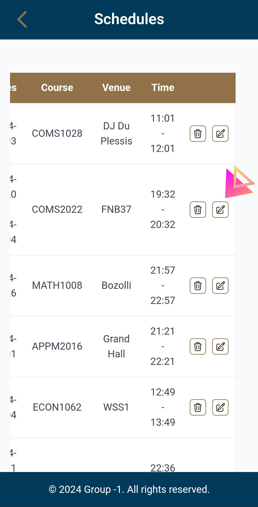
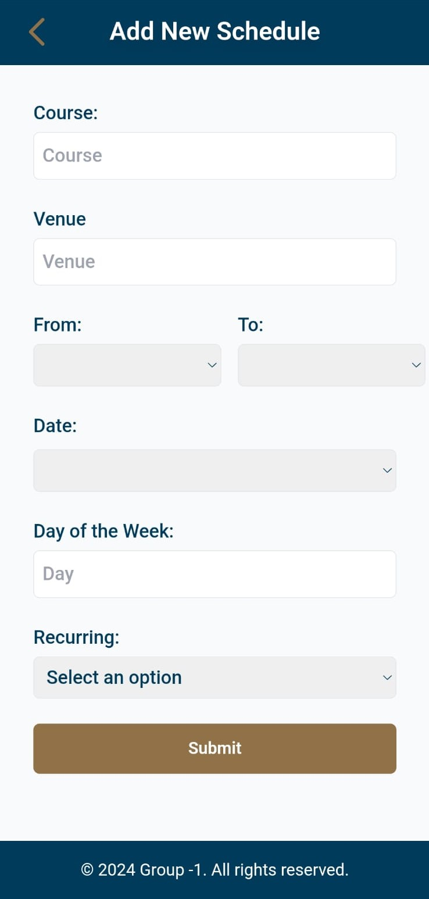

# Component Details :wrench:

## Details of Features

### Login

#### Authentication
- **Purpose**: Allows users to log in using their credentials.
- **Required Information**: Name, surname, faculty, role. Optionally, check if they are a tutor or lecturer.
- **Whitelisting**: Certain emails not affiliated with The University of Witwatersrand may be whitelisted if they have valid reasons (e.g., guest lecturers).

#### Users
- **Student**: Access to reporting, booking venues, viewing information about venues and making reservations.
- **Student (Tutor)**: Additional permissions for tutoring activities and resources.
- **Staff (Lecturer)**: Permissions include booking venues, managing academic schedules, and accessing staff resources.
- **Staff (Admin)**: Permissions include everything in the generic dashboard and managing reports, bookings, whitelisting and managing schedules.

### Schedule Integration

- **Create a Schedule**:
  - **Fields**: Course, Venue, Day of the Week, Times, Date, and Recurrence.
  - **Time** type is used to input times, and **Date** type is used to input a date.
  - If Recurrence is "Yes", an option to add an end date is provided.
  - **Submit** button adds the information to the database.

- **Schedule Timetable**:
  - Displays all timetables made by the user, including the day, date, course, venue, and times.
  - Includes a delete button to remove a schedule.
  - Includes an edit button to update a schedule. 
  - A button at the bottom takes the user to the form to add a schedule.

### Maintenance

- **Make a Report**:
  - **Fields**: Report Type, Venue, Description.
  - **Generated Data**: `createdAt` timestamp, status, `userId` which is the user email of the user who submitted the issue.

- **Log Page**:
  - Shows the status of a maintenance request as a sort of ticket log. the box shows the timestamp/created at date, the venue at which the request is taking place amd each request is under their respective status column.
  - Clicking on the maintenance log reveals a popup with more information like the request descriptiom where you can set the status, assigned staff, and scheduled completion time.
  - multiple requests for the same venue will be hidden untill the 'show more of this venue' button is clicked. 
  - in mobile view there is a 'show more' button to reveal all requests.


#### How It Was Implemented

- **Maintenance Report**: 
  - The frontend sends a POST request to the maintenance API with the input values from the HTML form.
  - You can search a valid venue name to associate your maintenace request with. This does a get request via the venue API based on the name of the venue.
  - The form input clears upon submission.

- **Maintenance Logs**:
  - A GET request fetches all maintenance requests.
  - Data is displayed in columns ("Scheduled", "In Progress") depending on status.
  - Desktop and mobile display functions handle dynamic display and creation of request blocks. 
  - The "Open Popup" function shows detailed information and allows editing of time, assignment, and status.
  - **Save Changes**: Updates the database via a POST request and reloads the page.
  - **Close Popup**: Hides the popup and returns to the maintenance logs screen.

### Notifications
- **Maintenance Notifications**:
- A bell button was implemented with a mini popup to house the latest maintenance requests from the last 48 hours.
- The functionality works by a GET request that filters the returned information by the date that the request was crested at.
- If you click 'Show All Requests' it redirects the user via html refrence to the maintenace logs page. 

## User Guides

### Landing page User Guide

##### Step 1: Welcome
1. **Access the Landing Page**:
   - The landing page is the main point of arrival.
2. **Introduction**:
   - You will see an information card with rules on how to login or request email approval.

### Request access User Guide

##### Step 1: Welcome
1. **Access the Request Page**:
   -This process is a 2 step process in which the requester inputs their name, surname and email address.
2. **Submission**:
   - You will submit your request which follows with a redirection to a status check page, which must be visited regularly to check the status of your request.


### Onboarding User Guide

#### Overview
The onboarding process is designed to collect essential information about you before you can fully access our platform. The process is divided into four steps:
1. **Welcome**
2. **Name and Surname**
3. **Faculty and Role**
4. **Checkboxes and Finish**

#### Step-by-Step Instructions

##### Step 1: Onboarding
1. **Access the Onboarding Page**:
   - Open the onboarding page from the provided link.
2. **Introduction**:
   - You will see a welcome message inviting you to tell us more about yourself.
3. **Start the Onboarding Process**:
   - Click the **"Get Started"** button to proceed to the next step.

##### Step 2: Name and Surname
1. **Enter Your Information**:
   - **Name**: Enter your first name.
   - **Surname**: Enter your last name.
2. **Validation**:
   - Ensure that both fields are filled out before proceeding.
3. **Proceed to Next Step**:
   - Click the **"Next"** button to move on.

##### Step 3: Faculty and Role
1. **Select Your Faculty**:
   - Choose your faculty from the dropdown menu:
     - Commerce, Law and Management
     - Engineering and the Built environment
     - Health Sciences
     - Humanities
     - Science
     - Other
2. **Select Your Role**:
   - Choose your role from the dropdown menu:
     - Student
     - Staff
3. **Validation**:
   - Ensure that both the faculty and role fields are selected before proceeding.
4. **Proceed to Next Step**:
   - Click the **"Next"** button to continue.

##### Step 4: Checkboxes and Finish
1. **Select Your Roles (if applicable)**:
   - **Tutor**: Check the box if you are a tutor.
   - **Lecturer**: Check the box if you are a lecturer.
2. **Validation**:
   - You must select at least one checkbox (either tutor or lecturer) to complete the onboarding process.
3. **Complete Onboarding**:
   - Click the **"Finish"** button to submit your information.
4. **Completion**:
   - You will see a confirmation message. You will be redirected to the user dashboard upon successful completion.

#### Troubleshooting
- **Form Validation Errors**:
  - Ensure all required fields are filled out.
  - Verify that at least one checkbox in the final step is selected.
- **Submission Issues**:
  - If you encounter any issues, check your network connection and try again. If the problem persists, contact support.

### General User Dashboard Guide

#### Overview
Welcome to the Dashboard of your web application! This guide provides an overview of how to navigate and use the various features of the dashboard, including viewing upcoming bookings, viewing available venues and making maintenance reports.

#### Dashboard Layout

##### Header
- **Logo**: Located at the top left of the header.
- **Title**: Displays the name of the application 'Infrustructure Management'.
- **Accesses**: Located at the top right of the header, there is a notification bell and navigation menu icon.

##### Main Content

###### Desktop View

- **Venues**:
  - **Description**:This shows the venues available to book, through generic category images. The last image has a click ability which upon clicking will navigate the user to a whole page showing all available venues, the 'Available venues' page.
  -**Available venues page**:
  - This page can be accessed via the last image in the 'Available venues' section, or via the 'Venues' tab in the nav bar, it shows the venues available to be booked in the next slot of the day and also contains an extra information button about those venues.

- **Upcoming Bookings**:
  - **Description**: Shows the first 3 bookings scheduled for the future, when there are more than 3 bookings, users navigate to the 'Your bookings' page via the 'see more' link what will appear beneath the bookings. 
  -**Your bookings page**:
  - This page can be accessed via 'see more' under the bookings on the main page or via the navigation bar under the 'Bookings' tab,
  -This page allows you to see upcoming bookings which you can choose to cancel and past bookings which you can choose to book again.

- **Footer**: Contains campus security information, a map to find your way around campus and naturally, Group -1's copy right.

###### Mobile View
- **Venues**:
  - **Description**: This shows the venues available to book, through generic category images. The last image has a click ability which upon clicking will navigate the user to a whole page showing all available venues, the 'Available venues' page.
  -**Available venues page**:
  - This page can be accessed via the last image in the 'Available venues' section, or via the 'Venues' tab in the nav bar, it shows the venues available to be booked in the next slot of the day and also contains an extra information button about those venues.

- **Upcoming Bookings**:
  - **Description**: Shows the first 3 bookings scheduled for the future, when there are more than 1 booking, users navigate to the 'Your bookings' page via the 'see more' link what will appear beneath the bookings. 
  -**Your bookings page**:
  - This page can be accessed via 'see more' under the bookings on the main page or via the navigation bar under the 'Bookings' tab,
  -This page allows you to see upcoming bookings which you can choose to cancel and past bookings which you can choose to book again.

- **Footer**: Contains campus security information, a map to find your way around campus and naturally, Group -1's copy right.

#### Features

##### Viewing Bookings
- **Desktop**: The desktop view displays both upcoming and past bookings in separate sections with pagination controls.
- **Mobile**: The mobile view provides a compact summary of bookings, with one item displayed from upcoming and past bookings respectively.

##### Booking Management
- **Cancel Booking**: Cancels the selected booking.
- **Rebook**: Rebooks the selected past booking.

##### Pagination Controls
- **Previous Button**: Allows navigation to the previous page of bookings.
- **Next Button**: Allows navigation to the next page of bookings.
- **Visibility**: Pagination controls are visible only when there are multiple pages of bookings.

#### Functionality
- **Loading State**: Displays a loading message while fetching booking data.
- **Date and Time Formatting**:
  - **Date**: `DD/MM/YY`
  - **Time Slot**: `HH:MM-HH:MM`


### Admin User Dashboard Guide

#### Overview
The Admin Dashboard provides an interface for managing bookings, venues, reports, and schedules. It also facilitates communication and tracking of user requests related to whitelisting and maintenance reports.

#### Features
##### Manage Bookings


##### Manage Venues

- View the list of all available venues.
- Add Venues: Click the "Add Venue" button to add new venues. Fill in the necessary details (name, location, capacity, etc.) and save.


##### Manage Reports
- View all the maintenanc logs in a ticket format.
- Click on a request to edit who it is assigned to, its status and the timestamp for when it will be done.

##### Manage Schedules

- view all schedules.
- Click on "Add schedule" and fill in all needed details to create a new schedule. 

##### Notifications
- View maintenance requests from the last 48 hours
- Click 'Show All Requests' to be taken to the maintenance logs page.


##### Inbox

- Whitelisting Requests: Access the inbox to view requests from users wanting to be added to the whitelist. You can review these requests and take appropriate actions (accept/reject).

##### Navigation Menu

- Menu Button: Click the menu button to access additional navigation options:
- View All Whitelist Members: View a list of all users currently on the whitelist.
- Whitelist Requests: Quickly navigate to the section showing pending whitelist requests.
- User Dashboard: Go to the general user dashboard view.


#### How to Use the Dashboard
- Login: Access the dashboard by logging in with your admin credentials.


##### Manage Venues: 
- Select “Manage Venues” to view all venues.
- Click on the “Add Venue” button to enter details for a new venue.
- Ensure all necessary fields are filled out before saving.


##### Manage Reports: 
- Select 'Manage Reports' to view all maintenance logs
- Arrive at the page with columns for "Scheduled," "In Progress," and "Completed."
<div style="text-align: center;">
  
</div>
- If venues have multiple requests tied to them then you can click 'Show more for this venue button' to see all the requests for that venue.
- Click on a block that displays Venue: name, with a date.
- View the popup with detailed information.
<div style="text-align: center;">
  
</div>
<div style="text-align: center;">
  
</div>
- Edit fields such as Assigned to, date picker, and Status bar dropdown if necessary.
- You can see all staff users to assign tasks to.
<div style="text-align: center;">
  
</div>
- You can only assign a timestamp field in the "In Progress," and "Completed" statuses.
- Click "Save Changes" to save changes and reload the page or "Close" the popup to return without saving.
- Press the maintenance log page back arrow on the top left corner to return to the user dashboard.


##### Manage Schedules: 

- Viewing: click on "Schedules" in order to be able to view all schedules.
- Creating: Click on "Add schedule" to be redirected to a new page where you can create a new schedule.
- Submitting: after filling out all the information, click "Submit" in order to submit your information.
- Delete: click the bin icon to delete a specific schedule.
- Edit: click the pen icon to edit the information of a schedule. Then click "Update" to save your changes.

##### Notifications: 
- Login as an admin.
- Click the bell icon on the Admin dashboard.
- See the last 48 hours of maintenance requests
- Click 'Show All Requests'
- Takes you to all maintenance logs

##### Inbox: 
- Open the inbox to see all requests.
- Approve or deny requests as necessary based on your criteria.

##### Navigation menu: 


- Click the menu button to explore additional options.
- Select links to view whitelist members or navigate back to the admin dashboard.


### Venue Booking System

#### Overview
This guide provides instructions on how to use the venue booking system. It covers two main pages:
1. **Book a Venue** - For searching and filtering available venues.
2. **Booking Details** - For viewing detailed information about a selected venue and making a booking.

#### 1. Book a Venue

##### Page Overview
The "Book a Venue" page allows you to search and filter available venues. You can select a venue to view its details and make a booking.
<p style="text-align: center;">
    
</p>

##### Features
- **Search Bar**:
  - Located at the top of the page.
  - Type the name of the room or venue you are looking for.
  - Results will dynamically update based on your input.
- **Filter Dropdown**:
  - Allows you to filter venues by type (e.g., Lecture Hall, Tutorial Room, Boardroom, Exam Venue).
  - Options are displayed as a dropdown menu.
- **Venue List**:
  - Displays available venues based on search and filter criteria.
  - Each venue card includes an image, brief description, and a "View Details" button.
- **View Details Button**:
  - Takes you to the Booking Details page where you can view more information and make a booking.

#### 2. Booking Details

##### Page Overview
The "Booking Details" page provides detailed information about a selected venue and allows you to book the venue.
<p style="text-align: center;">
    
</p>


##### Features
- **Venue Information**:
  - Displays detailed information about the selected venue, including its name, type, and available features.
  - **Image**: Shows a large image of the venue.
- **Booking Form**:
  - **Date**: Select the date you want to book the venue.
  - **Start Time**: Choose the start time for your booking.
  - **End Time**: Choose the end time for your booking.
  - **Purpose**: Enter the purpose of the booking.
  - **Submit Button**: Completes the booking process and adds the venue booking to the system.
- **Booking Confirmation**:
  - After submission, you will receive a confirmation message and be redirected to your bookings page.
  <p style="text-align: center;">
    
</p>


### Schedules

### Schedule
- Click on "Manage Schedules" on the admin dashboard.
<div style="text-align: center;">
  
</div>


- This will take you to a new page where you will be able to view all created schedules.
<div style="text-align: center;">
  
</div>


- On each row, there is a button with a bin. Click on this button in order to delete a schedule. You will be asked to confirm your deletion: click yes (or cancel if you do not want to).
<div style="display: flex; justify-content: center; align-items: center;">
  
  
</div>

- Beside that button, is a another button to edit your schedule details. If you click on this button, you will find a popup. Edit the information that you would like to and click "Update". ELse you can click "Close".
<div style="display: flex; justify-content: center; align-items: center;">
  
  
</div>

- Beneath the table is a button which says "Add a Schedule". Clicking this button will take you to a new page with a form.
<div style="text-align: center;">
  
</div>

- Type in your name, the course of the schedule and the venue where it will be held. Select a day and venue from the drop-down. You can use the clocks under "Time" to choose a time or input your own time directly. You can click the calendar to choose a date or input your own date.
<div style="text-align: center;">
  
</div>

- Then if your schedule is one that recurs weekly, click "yes" on the Recurring dropdown. This will casue another Date picker to appear. Here you must choose the date that your last schedule will be held on. Otherwise, if your schedule is only for one day, choose "no".
<div style="text-align: center;">
  
</div>

- Once the form is fully filled out, you can click the "Submit" button to add your new schedule.
<div style="text-align: center;">
  
</div>


### Maintenance

#### How to Make a Maintenance Report
1. Click the plus on your user dashboard and select "Report."
2. Or click on 'Report' in the navigation bar
<div style="text-align: center;">
  
</div>
<div style="text-align: center;">
  
</div>
<div style="text-align: center;">
  
</div>

3. Fill in the venue where the issue took place (e.g., a lecture hall, a tutorial room, a conference hall or a laboratory). A dropdown will appear to assist you with inputting a valid venue.

<div style="text-align: center;">
  
</div>

4. Select an issue type (e.g., Electrical, Ventilation, Pests and Rodents, Roofing and Ceiling, Other).
5. Write a short description of the issue.
6. Click "Submit." The input should clear.
7. Press the back arrow in the top left corner to return to the user dashboard.
8. If you do not fill in every field then you can not submit the form.

### User Guide for Manage Bookings Page

### Overview
The **Manage Bookings** page allows users to efficiently view, search, and filter room bookings within an organization. This page provides an intuitive interface to manage bookings, ensuring users can quickly find the information they need and take necessary actions on their bookings.

### Key Features

### Header
- **Page Title**: Displays "Manage Bookings" at the center of the header.
- **Back Button**: Located on the left side of the header, this button allows users to navigate back to the previous page or to the user dashboard if there's no previous page in history.

### Search Bar
- A search bar located below the header allows users to search for specific rooms. Users can type in keywords related to the room they are looking for.
- An icon of a magnifying glass is provided to indicate the search functionality.

### Filter Options
- Users can filter bookings based on their status (e.g., Pending, Confirmed, Cancelled) using a dropdown menu.
- Additionally, users can filter bookings by room type (e.g., Lecture Hall, Tutorial Room, Boardroom, Other).

### Bookings Display
- The main section of the page dynamically updates to display booking information based on user input in the search bar and filters.
- Each booking entry includes the room name, room type, date, time, purpose, and status of the booking.

### Action Buttons
- Depending on the status of the booking, users may see options to **Edit**, **Cancel**, **Accept**, or **Reject** a booking.

### Footer
- The footer contains copyright information for the organization, reaffirming the date and group responsible for the page.

## How to Use the Manage Bookings Page

### Navigating the Page
Upon loading, the page displays the header and footer, along with the central content area for managing bookings.

### Searching for a Room
In the search bar, type the name or keywords related to the room you want to find. The search results will be updated dynamically based on the input.

### Filtering Bookings
- Use the **Status** dropdown to filter bookings based on their current status.
- Use the **Filter** dropdown to select the type of room you are interested in (e.g., Lecture Hall, Boardroom). The bookings displayed will adjust accordingly.

### Viewing Booking Details
Each booking box will display relevant information, including:
- Room Name
- Room Type
- Booking Date
- Booking Time (Start and End)
- Purpose of the booking
- Current Status of the booking

### Taking Action on Bookings
- If the booking status is not pending, you will see an **Edit** button to modify the booking details.
- If the status is confirmed or accepted, a **Cancel** button will be available to cancel the booking.
- For pending bookings, options to **Accept** or **Reject** the booking will be visible.

### Returning to the Dashboard
Use the back button on the left side of the header to return to the previous page or the user dashboard.


## Maintenance Guides for all features.

### How to deploy the site locally

This guide will walk you through the steps required to set up and run the Campus Infrastructure Management site on your local machine.

### Prerequisites

Before you begin, ensure you have the following installed on your system:

- **Git**: For cloning the repository.
- **Node.js and npm**: For running the application and managing dependencies.
- **A `.env` File**: Contains environment variables needed for the application. Obtain this file from the project maintainers.

### Step-by-Step Guide

#### 1. Clone the Repository

Open your terminal or command prompt and execute the following command to clone the repository:

```bash
git clone https://github.com/witsgroup-1/campus-infrastructure-management.git
```

This will create a local copy of the project in a folder named `campus-infrastructure-management`.

---

#### 2. Navigate to the Project Directory

Move into the project directory:

```bash
cd campus-infrastructure-management
```

---

#### 3. Install Project Dependencies

Install the required npm packages:

```bash
npm install
```

This command reads the `package.json` file and installs all the dependencies listed under `dependencies` and `devDependencies`.

---


#### 5. Obtain and Place the `.env` File

The `.env` file contains sensitive configuration data like API keys and database credentials. **Do not commit this file to version control.**

- **We will include this file in our submission on moodle.
- **Place the `.env` File**: Put the `.env` file in the root directory of the project (`campus-infrastructure-management/`).

---

#### 6. Run the Application

Start the application using Node.js:


```bash
node app.js
```


---

#### 7. Access the Application in Your Browser

Open your preferred web browser and navigate to:

```
http://localhost:3000
```

Replace `3000` with the port number specified in your application's configuration if it's different.

---


#### Important Notes

- **Do Not Commit Sensitive Information**
- **Node.js Version**: Verify that you are using a compatible Node.js version as specified in the project's documentation or `package.json` (if specified under `engines`).

- **Update Dependencies**: If necessary, update the project's dependencies:

  ```bash
  npm update
  ```


- **Troubleshooting**:

  - **Missing Modules**: If you encounter errors about missing modules, try removing `node_modules` and reinstalling:

    ```bash
    rm -rf node_modules
    npm install
    ```


  - **Environment Variable Issues**: Ensure that all required environment variables are correctly defined in the `.env` file.

---

### Conclusion

You should now have the Campus Infrastructure Management site running locally on your machine. If you encounter any issues, consult the project's documentation or reach out to the development team for assistance.

---

**Note**: Always follow best practices for security and configuration management when handling environment variables and sensitive data.


### User Dashboard Maintenance Guide: 

Dashboard Components:

A. Venue Section
Functionality: Displays images of venues and contains a link to an 'Available Venues' page to show venues available to book in the next slot.

  - Maintenance:
    - Ensure the backend API fetching venue data is functional.
    - Check that venue data is correctly updated in the database and reflected on the dashboard.
    - Test the venue section UI after changes to the database or API.

  - Common Issues:
    - Venue data not showing: Check API response and connectivity.
    - Data mismatch: Ensure synchronization between the venue database and UI.

B. Upcoming Bookings Section
Functionality: Shows upcoming bookings for the logged-in user.

  - Maintenance:
    - Ensure correct fetching of user-specific booking data from the database with the use of the users API.
    - Check data synchronization, especially when new bookings are added or cancelled.
    - Verify that upcoming bookings are displayed in the correct time format.
  - Common Issues:
    - No upcoming bookings displayed: Confirm the API query is filtering by the correct user ID.
    - Booking details incorrect: Ensure the database and booking system are up to date.

C. Floating Button (Quick Access to Report and Book Pages)
Functionality: Provides quick navigation to the report and booking pages.


  - Maintenance:
    - Test that the button links correctly to the respective pages.
    - Ensure UI elements remain responsive across different devices.
    - Check the floating button’s positioning and appearance after any UI updates.
  - Common Issues:
    - Button not clickable: Check if the link or route in the frontend is broken.
    - Incorrect redirection: Confirm that the button routes match the intended destination URLs.

D. Notification Bell
Functionality: Displays notifications to users.

  - Maintenance:
    - Verify notification fetching from the database using the notifications API.
    - Ensure that unread notifications are marked properly and disappear when viewed.

  - Common Issues:
    - Notifications not showing: Check the API responsible for fetching notifications.
    - Notifications not clearing: Ensure state management is handled properly after viewing notifications.

E. Menu Button (Navigation Bar)
Functionality: Opens a navigation bar with links to various pages.

  - Maintenance:
    - Ensure that the menu opens and closes properly across different screen sizes.
    - Verify the links in the navigation bar are correctly routed to the desired pages.
    - Test the interaction of the menu button with other UI elements, such as the floating button or notification bell.

  - Common Issues:
    - Menu not opening/closing: Debug potential JavaScript issues or CSS conflicts.
    - Incorrect navigation: Ensure each link’s route is configured correctly in the app.

#### Testing

- Regularly test each component of the dashboard after updates or deployments.
- Use browser developer tools to inspect elements, monitor API requests, and debug issues.
- Ensure that after any UI or backend changes, a full suite of tests (unit, integration, and end-to-end) is run.

- Updates and Future Maintenance
    - When adding new venues, the backend API is updated to reflect changes.
    - Ensure compatibility with new browsers and devices by testing on different platforms.

#### Troubleshooting Guide
Venue not displaying: Check API response, database connection, and inspect browser console for errors.
Bookings not updating: Ensure real-time syncing is functioning, and validate backend database changes.
Notification bell not working: Inspect API responses and front-end JavaScript.
Navigation bar links broken: Verify route configurations in the front-end codebase.

*** End of userdashboard maintenance guide. ***


API Key:
- The API key (apiKey) is a sensitive piece of information used to authenticate requests to the API.
- Ensure that the API key is rotated on a regular basis for security.

### Maintenance Reports
- Posting data to the API
  - The codes input is posted to the maintennce requests database via the maintenanc API endpoint. 
  - Tasks:
		- Check that the correct data is generated and is being parsed to the API.
    - Always check the status of the API response to ensure it is successful.
    - Ensure robust error handeling with try-catch blocks.
    - Log errors meaningfully with console.error(); to diagnose problems.
- Form Clear:
  - Tasks:
    - make sure that the form clears after a submited request.

Common issues:
- The API POST does not send: Check the error message.
- The Form does not clear: Check how the code interacts with the input fields.

### Maintenance Logs:
- Fetching Data from the API:
    - The code fetches maintenance requests from an API endpoint and processes them based on their status (Scheduled, In Progress, Completed).
    - Tasks:
        - Always check the status of the API response to ensure it's successful before processing the data.
        - Ensure robust error handling with try-catch blocks.
        - Log errors meaningfully with console.error(); to diagnose problems.
- Handling and Displaying Maintenance Requests:
    - Maintenance requests are filtered into different categories: "Scheduled", "In Progress", and "Completed".
    - Date Handling: Ensure the timestamps are correctly converted into a human-readable format using: new Date(request.timestamp.seconds * 1000).toLocaleString();
    - Ensure the function 'displayInitialRequestsForMobile' works so as to ensure consistently responsive displays accross devices.
- Updating Maintenance Requests:
    - Maintenance requests can be updated through the saveChanges function, which sends a PUT request to the API.
    - Tasks:
        - Ensure Correct Status is Reflected: Check that the status changes (like Scheduled, In Progress, or Completed) are saved properly.
        - Ensure that the timestamp is updated: Check that logs in 'in Progress' have an updated timestamp after updating it.
        - Check that the timestamp of logs in the 'Sheduled' and 'Completed' columns can not be edited. 

Common issues:
- The logs do not show up, check that the API request has gone through.
- The 'Show more' button: check that it shows more requests.
- 'save changes': check if the POST request is working and that the page relods. 


### Schedule Integration
#### Timetables

A. Displaying schedules: all created schedules are displayed in a table.

- Maintenance:
 - Ensure that the schedule API is fetching data from the backend correctly. 
 - Ensure that changes to the schedules are displayed appropraitely. 
 - Ensure that deleted schedules are removed from the table.

- Common issues:
 - Incorrect syntax when displaying schedules: edit the html to display schedules as expected.
 - Schedules not updating: check API is being handled correctly.

B. Delete button: button to delete a specific schedule by ID.

- Maintenance: 
 - Ensure button is clickable.
 - Ensure that confirmation popup appears when button is clicked. 
 - Ensure schedule is appropriately deleted.

- Common issues:
 - Alert does not appear: check that the button functionality is working.
 - Schedule is not deleted: check API is being handled correctly.

C. Edit button: button to edit a specific schedule by ID.

- Maintenance: 
 - Ensure button is clickable.
 - Ensure that popup appears when button is clicked. 
 - Ensure schedule is appropriately updated when "Update" is clicked.
 - Ensure popup is closed when "Close" button is clicked.

- Common issues:
 - Popup does not appear: check that the button functionality is working.
 - Schedule is not updated: check API is being handled correctly.
 - Popup does not close: check that "Close" button works as expected.

D. Add Schedule button: button that takes you to a new page so you can create a new schedule.

- Maintenance: 
 - Ensure button is clickable.
 - Ensure that the button takes you to the new, correct page.

- Common issues:
 - Button does not take you to a new page: check that the button has a corresponding link.
 - Button takes you to the wrong page: check that the correct link is being used.

# Add Venues Page

## User Manual

### Overview

The Venue Management System is a web-based application that allows users to add new venues and view existing ones. It features a campus map and a form for adding venues.

### Features

1. **Campus Map**: Displays the Wits Braamfontein Campus Map.
2. **Add Venue Form**: Allows users to add new venues with details.
3. **Existing Venues List**: Shows all venues currently in the system.

### How to Use

#### Adding a New Venue

1. Scroll to the "Add Venue" section.
2. Fill out the form with the following details:
   - Name
   - Capacity
   - Category
   - Features
   - Building
3. Click the "Add Venue" button.
4. If successful, you'll see an alert saying "Venue added successfully".

#### Viewing Existing Venues

1. Scroll down to the "Existing Venues" section.
2. All current venues will be displayed here.
3. Each venue block shows:
   - Name
   - Capacity
   - Category
   - Features
   - Building
# Mapping Campus Locations with Leaflet and Campus Transport API

We are using [Leaflet](https://leafletjs.com/) for creating an interactive map and the [Campus Transport API](https://api-campus-transport.vercel.app/getLocations) to fetch location data. The API provides location coordinates and related details, which are dynamically marked on the map as markers. This integration allows users to view campus transport locations in real-time, making it easier to navigate through the area.


## Maintenance Guide

### Updating the Campus Map

To update the campus map:

1. Locate the `<iframe>` tag in the HTML.
2. Replace the `src` attribute with the new Google Maps embed URL.

### Modifying the API Endpoint

If the API endpoint changes:

1. Find the `fetchVenues` and form submission functions in the `<script>` tag.
2. Update the URL in the `fetch` calls to the new endpoint.

### Changing the API Key

To update the API key:

1. Locate the `apiKey` variable at the beginning of the script.
2. Replace its value with the new API key.

### Styling Changes

The page uses Tailwind CSS. To modify styles:

1. Adjust the class names in the HTML elements.
2. For custom styles, add them to a separate CSS file or use Tailwind's configuration file.

## How It Works

### HTML Structure

- The page is divided into three main sections:
  1. Campus Map
  2. Add Venue Form
  3. Existing Venues List

### JavaScript Functionality

1. **DOMContentLoaded Event Listener**:
   - Sets up the form submission handler and calls `fetchVenues()`.

2. **Form Submission**:
   - Prevents default form submission.
   - Collects form data and creates a venue object.
   - Sends a POST request to the API to add the new venue.
   - On success, resets the form and refreshes the venues list.

3. **fetchVenues Function**:
   - Sends a GET request to the API to retrieve all venues.
   - Calls `displayVenues()` with the retrieved data.

4. **displayVenues Function**:
   - Clears the existing venues list.
   - Creates a venue block for each venue and appends it to the list.

5. **createVenueBlock Function**:
   - Creates a DOM element for each venue with its details.

### API Integration

- The system uses a REST API for venue management.
- Endpoints:
  - POST: `https://campus-infrastructure-management.azurewebsites.net/api/venues`
  - GET: `https://campus-infrastructure-management.azurewebsites.net/api/venues`
- Authentication is done using an API key in the `x-api-key` header.

### Styling

- The page uses Tailwind CSS for styling, loaded via CDN.
- Custom color classes are used for branding (e.g., `text-[#003B5C]`).
