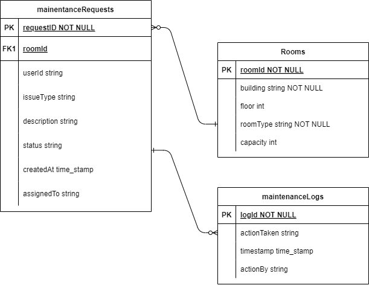

# Database Schema :floppy_disk:

For our project, we use a **Hierarchical Model**, which organizes data in a “tree-like” structure with parent-child relationships. Our chosen database, Firebase Firestore, uses this hierarchical model to effectively manage and scale our data.

## User Database :file_folder:

**Users Collection**

**1. Collection**: `users`

**Document**: `{userId}` (Document ID is a unique identifier for each user, such as `firebase_uid`)

**Document Fields:**

- `name`: User’s first name (string)
- `surname`: User’s last name (string)
- `email`: User’s Wits email address (string)
- `role`: User’s role (string) – e.g., student, or staff
- `faculty`: User’s faculty or department (string)
- `is_tutor`: Indicates if the user is a tutor (boolean)
- `is_lecturer`: Indicates if the user is a lecturer (boolean)
- `{bookings}`: Contains all the bookings that the user made in the form of documents(collection). -`{courses}`: Contains all the user's courses in the form of documents(collection).

**Example Document:** <br>
In the example below, the `staff` user should be able to make bookings for lecture halls, meeting rooms, tutorial rooms, and exam venues since the `is_lecturer` field is set to `true`. If it was set to `false`, they would not have the priviledge to do so.

> ```json
> {
>   "name": "John",
>   "surname": "Doe",
>   "email": "john.doe@wits.ac.za",
>   "role": "staff",
>   "faculty": "science",
>   "is_tutor": false,
>   "is_lecturer": true,
>   {bookings},
>   {courses}
> }
> ```

**Example Document:** <br>
In the following example, the student user should be able to make bookings for tutorial rooms since the `is_tutor` field is set to `true`.

> ```json
> {
>   "name": "Mitsy",
>   "surname": "Nkuna",
>   "email": "2538929632@students.wits.ac.za",
>   "role": "student",
>   "faculty": "science",
>   "is_tutor": true,
>   "is_lecturer": true,
>   {bookings},
>   {courses}
> }
> ```

**Example Document:** <br>
In the following example, the student user should be able to make bookings for study rooms only since the `is_tutor` field is set to `false`.

> ```json
> {
>   "name": "Mitsy",
>   "surname": "Nkuna",
>   "email": "2538929632@students.wits.ac.za",
>   "role": "student",
>   "faculty": "science",
>   "is_tutor": false,
>   "is_lecturer": true,
>   {bookings},
>   {courses}
> }
> ```

**2. Bookings Subcollection**

**Subcollection**: `bookings` (inside each user document)

**Document**: `{bookingId}` (Document ID for each booking)

**Document Fields:**

- `venue_id`: The unique identifier for the venue in the collection that consists all venues on campus (string)
- `name`: The name of the venue. e.g., WSS1.
- `start_time`: The start time of the booking (timestamp)
- `end_time`: The end time of the booking (timestamp)

**Example Document**

> ```json
> {
>   "venue_id": "DcGxOJax93od7C4B8VQ8",
>   "name": "wss1",
>   "start_time": "2024-10-19T10:15:00Z",
>   "end_time": "2024-10-19T11:00:00Z"
> }
> ```

**3. Courses Subcollection**

**Subcollection**: `courses` (inside each user document)

**Document**: `{courseId}` (Document ID for each course)

**Document Fields:**

- `course_id`: The unique_id for the document belonging to that course in the collection containing all courses.
- `lecturer_id`: The `userId` for the lecturer user.

**Example Document:**

> ```json
> {
>   "course_id": "Wh89K9693odHom85230K",
>   "lecturer_id": "Hcd9xOJax93o72djh3dHgP"
> }
> ```

**Summary of Schema Structure**


---

---

## Booking Database :clipboard:

**1. Bookings Collection**

**Collection Name:** `bookings`

**Documents:** Each document represents a booking and is identified by a unique `bookingId`.

**Document Fields:**

- **`bookingId`** (String, **Unique Identifier**): A unique identifier for each booking.
- **`venueId`** (String, **Foreign Key**): The unique identifier of the venue being booked.
- **`roomID`**(String, **Foreign Key**): The unique identifier of the room being booked.
- **`userId`** (String, **Foreign Key**): The unique identifier of the user who made the booking.
- **`start_time`** (Timestamp): The start time of the booking (ISO 8601 format).
- **`end_time`** (Timestamp): The end time of the booking (ISO 8601 format).
- **`date`** (Timestamp): The date of the booking
- **`purpose`** (String, Optional): The purpose of the booking.
- **`status`** (String): The status of the booking (e.g., "Confirmed", "Pending", "Cancelled").

**Example Document:**

```json
{
  "bookingId": "1234",
  "venueId": "0001",
  "roomID": "100",
  "userId": "1000",
  "start_time": "T09:00:00Z",
  "end_time": "T10:00:00Z",
  "date": "2024-09-01",
  "purpose": "SDP Lecture",
  "status": "Confirmed"
}
```

---

**2. Venues Collection**

**Collection Name:** `venues`

**Documents:** Each document represents a venue and is identified by a unique `venueId`.

**Document Fields:**

- **`venueId`** (String, **Unique Identifier**): A unique identifier for each venue.
- **`name`** (String): The name of the venue.
- **`category`** (String): The type of venue that it is (lecture hall, exam venue, dining...)

**Example Document:**

```json
{
  "venueId": "0001",
  "name": "FNB Building",
  "category": "Lecture Venue"
}
```

**Subcollection:** `rooms` (inside each venue document)

**Document:** `{roomId}` (Document ID, unique identifier for each room)

**Document Fields:**

`room_id`: Unique identifier for the venue (string, generated by Firebase)
`name`: Actual name of the room (string)
`location`: Physical location of the room within the venue (string)
`capacity`: Maximum number of people the room can accommodate (integer)
`features`: List of features available in that room (array of strings, optional)

**Document Example**:

```json
{
  "room_id": "001",
  "name": "FNB 37",
  "location": "Floor 1, FNB Building",
  "capacity": 40,
  "features": ["Projector", "Whiteboard", "Wi-Fi"]
}
```

**Summary of Schema Structure**


---

## Schedule Database :calendar:

**Schedule Collection**

**1. Collection** : `schedules`

**Document** : `{scheduleId}`

**Document Fields** :

- `roomId` (string): the room/venue where the lesson will take place.
- `courseId` (string): the course that will be taught.
- `startTime` (timestamp): the time at which the lesson begins.
- `endTime` (timestamp): the time at which the lesson ends.
- `daysOfWeek` (string): the days on which the lesson takes place.
- `startDate` (timestamp): the date on which the lessons begin.
- `endDate` (timestamp): the date on which the lessons end.
- `recurring` (boolean): indicates whether the lesson recurs on a timely basis.
- `userId` (string): the identifier for the lecturer that created the schedule. (Only lecturers can create schedules.)

**Example Document:** <br>

> ```json
> {
>   "roomId": "Room101",
>   "courseId": "COMS3011A",
>   "startTime": "10:00",
>   "endTime": "12:00",
>   "daysOfWeek": "Monday",
>   "startDate": "2024-01-24",
>   "endDate": "2024-06-14",
>   "recurring": "True",
>   "userId": "Lecturer1923"
> }
> ```

**2. Subcollection** : `rooms`

The `rooms` subcollection is found inside every `schedule` collection. It contains the details of the room that is being booked for a particular course.

**Document** : `{roomsId}`

**Document Fields:**

- `roomId` (String): The identifier for the room or venue.
- `building` (String): The building where the room is located.
- `floor` (String): The floor on which the room is located.
- `roomType` (String): The type of room.
- `capacity` (Number): The capacity of the room.

  **Example Document:**

> ```json
> {
>   "roomId": "Room101",
>   "building": "Science Building",
>   "floor": "2nd",
>   "roomType": "Tutorial Room",
>   "capacity": 20
> }
> ```

**Reference** : `courses`

The `schedules` collection makes reference to the `courses` subcollection. This subcollection specifies which course the lecturer will teach in that time slot.

**Document**: `{courseId}`

**Document Fields:**

- `course_code`: (string) The code of the course.
- `lecturer_email`: (string) The email of the course instructor that created the schedule.

**Example Document:**

> ```json
> {
>   "course_code": "COMS3011A",
>   "lecturer_email": "adamwhite@wits.ac.za"
> }
> ```

**Summary of Schema Structure**


## Maintenance Database :hammer_and_wrench:

**Maintenance Collection**

**1. Collection** : `maintenanceRequests`
**Document**: `{requestId}`

**Document fields**:

- `roomId` (String): Identifier for the room or venue where the issue was reported.
- `userId` (String): Unique identifier for the user who reported the issue (e.g., firebase_uid).
- `issueType` (String): The type of issue reported – e.g., "Electrical," "Plumbing."
- `description` (Text): Detailed description of the issue.
- `status` (String): Current status of the request – e.g., "Open," "In Progress," "Resolved."
- `createdAt` (Timestamp): Date and time when the request was created.
- `assignedTo` (String): Identifier for the staff member assigned to the request.

**Example Document:** <br>

> ```json
> {
>   "roomId": "Room101",
>   "userId": "User123",
>   "issueType": "Electrical",
>   "description": "Light not working",
>   "status": "Open",
>   "createdAt": "2024-08-12T09:00:00Z",
>   "assignedTo": "Staff456"
> }
> ```

**2. Subcollection: `maintenanceLogs`**

This subcollection is found inside each `maintenanceRequests` document. It tracks the history of actions taken on the request.
**Document**: `{logId}`

**Document Fields:**

- `logId` (String): Unique identifier for the log entry.
- `actionTaken` (String): Description of the action – e.g., "Request created," "Status changed to In Progress."
- `actionBy` (String): Identifier for the user who performed the action.
- `timestamp` (Timestamp): Date and time when the action was taken.

**Example Document:** <br>

> ```json
> {
>   "logId": "Log001",
>   "actionTaken": "Request created",
>   "actionBy": "User123",
>   "timestamp": "2024-08-12T09:01:00Z"
> }
> ```

**3. Subcollection: `rooms`**

This subcollection is found inside each `maintenanceRequests` document. It contains information about the room or venue related to the maintenance request. This is useful if the room details need to be recorded separately or if multiple rooms are associated with a single maintenance request.

**Document**:`roomId`

**Document Fields:**

- `roomId` (String): Unique identifier for the room or venue – e.g., "Room101."
- `building` (String): The building where the room is located – e.g., "Science Building."
- `floor` (String): The floor on which the room is located.
- `roomType` (String): The type of room – e.g., "Classroom," "Lecture Hall," "Lab."
- `capacity` (Number): The capacity of the room – e.g., 30 students.

  **Example Document:**

> ```json
> {
>   "roomId": "Room101",
>   "building": "Science Building",
>   "floor": "1st",
>   "roomType": "Classroom",
>   "capacity": 30
> }
> ```

**Overall Structure:**

- **`maintenanceRequests` (Main Collection)**
  - **`requestId1` (Document)**
    - `roomId`: "Room101"
    - `userId`: "User123"
    - `issueType`: "Electrical"
    - `description`: "Light not working"
    - `status`: "Open"
    - `createdAt`: "2024-08-12T09:00:00Z"
    - `assignedTo`: "Staff456"
    - **`rooms` (Subcollection)**
      - `roomId1` (Document)
        - `roomId`: "Room101"
        - `building`: "Science Building"
        - `floor`: "1st"
        - `roomType`: "Classroom"
        - `capacity`: 30
    - **`maintenanceLogs` (Subcollection)**
      - `logId1` (Document)
        - `actionTaken`: "Request created"
        - `actionBy`: "User123"
        - `timestamp`: "2024-08-12T09:01:00Z"

**Summary:**

- **Main Collection: `maintenanceRequests`**

  - Stores general information about each maintenance request.

- **Subcollection: `rooms`**

  - Contains details about the specific room(s) involved in the maintenance request.

- **Subcollection: `maintenanceLogs`**
  - Tracks the history of actions taken related to the maintenance request.

**Summary of schema structure:**
