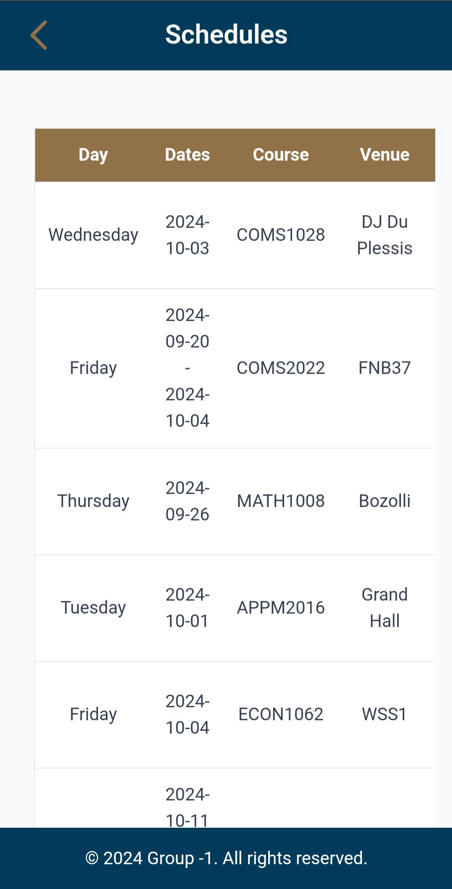

# Development Process :gear:

## Planning of Architecture

The initial focus at the beginning of the project was the technological stack that we would employ, the high-level view of the system which encompassed how data was stored and retrieved and the design of the User Interface (UI) and experience. 

Initial Architecture  

At the initial stage of the project we decided that we would employ a multi-tier architecture. This architecture was well suited to our project as we would need a front-end, a web hosting server, an Application Programming Interface (API) and a backend NO-SQL database.    

The reason we employed a NO-SQL database is due to the fact that they are offer high availability, performance and scalability. These features allow for our website to handle high levels of user traffic so that we can remain always online with our products services [1]. 

Furthermore, we had to decide on the NO-SQL database that we would employ.  As a group we went with the Firebase Firestore database as it is good for mobile development (which we had to account for due to responsive design principles) and scalability [2]. Firestore has real time data synchronisation [2] which would allow for our website to update its content quickly when new database entries and deletions occur. 

We decided to use an API with the Firestore database as we had to integrate with other subsystems and could not expect them to initialise our database infrastructure on their web applications. By using an API other teams could simply access our venue management data without worrying over the inner workings of the database. 

The website was hosted on Microsoft Azure as a web application as it was a service we as a team were most familiar with. Furthermore, the service offers services such as support for multiple languages such as Node.js, GitHub CI/CD pipeline integration and we would not have to worry about the finer details of hosting a web application as that would be managed by Azure [3].  Additionally, an important consideration was that our website needed to be hosted in our home country. This was to promote a good latency for University of Witwatersrand staff and students when using our website. Thankfully Azure has support for hosting the website from South Africa. 

The technology stack we used is:
- Frontend: HTML, CSS , Tailwind - (This is good for mobile-first development)
- Authentication: OAuth, and Firebase authentication
- Backend: Node Js, Express Js
- Databases: Firebase Firestore

## Diagrams
To help us illustrate the flow of our systems and their interactions we created a Component, Use case and a Deployment diagram [Figure].  
### Use Case Diagram

The Use case diagram to illustrate basic features.
.png)

### Deployment Diagram

The Deployment diagram to illustrate how our website deploys.
.png)

### Component Diagram

The system components can be seen below in the component diagram.

## Initial Development Phase 

Agile methodology is an iterative methodology that breaks down a project into sprints [4]. After each sprint a team must reflect on the sprint and adjust their strategy [4]. As a group we employed the agile methodology through the SCRUM Process [5].  

Initially as a group we outlined the project scope, designed the system architecture, set up version control, deployed a basic Azure web app, initialised the Jest testing environment, created the basic file structure and designed of the UI through wireframes and mock-ups.  This was all to ensure that we would create a stable environment in which to begin programming our project. 

Throughout this process we met with our client, who made sure to give us feedback such as changing mock-up colours and using tailwind CSS for our project UI. 

## Intermediate Development Phase 

The next milestone there was more of a focus on developing our systems from our planning and iteratively improving upon these systems as we went. We started working on creating the Firestore databases first. Then we created the APIs to retrieve the information from the database.  

With the API and database in place it was important that we secured our API through the use of an API key so that only valid users could access them. Our client suggested that we track the usage of these keys, so we implemented this. Since we had to provide our API to other groups, we gave them access as soon as possible.   

The next important implementation would be the UI based on the Figma mock-ups we had created.  Some of the designs appeared slightly different in the html due to how the Tailwind CSS was implemented. 

During this period, it was recommended by our client that we make the maintenance reports system like a ticket system, that we create an onboarding system for new users and that we make a whitelist for external users (for example temporary lecturers) that need access to university services. We followed the clients feature requirements when we added the functionality to our application.  

Implementing core functionality was always a priority, so we made sure to get these to a good standard as soon as possible for the final milestone after the UI was implemented.  

 
Integration was also an important aspect of the development process. Due to troubles with communication our client recommended we create our own APIs to make sure our program was robust. We created an API for security contact information and dining information. 

Finally, testing was an important aspect of our application as it made sure that our website would not be broken upon deployment. Jest was used to do widespread unit testing across our application. 
 
## Finalisation  

Towards the end of the project the focus was making sure that the UI was polished based on client and user feedback as well as making sure that we had finalised our integration testing to an extent. We incorporated the feedback into our application in order to ensure that it was user-friendly and comprehensive. 

Additionally, since we were struggling to get access to the APIs of other teams, we had to further refine our mocked APIs and be ready to receive their APIs at any time.  
 

### Tools and Technologies Used 

GitHub – To house our project. 

GitHub actions – CI/CD pipeline for this project.  

GitHub Projects [Figure 38] – Used to keep track of task assignment. 

WhatsApp – Communication Between team members and some daily standups 

Discord – Scrum Meetings (all types) between team members 

## UI/UX Design Process

### Design Choices 

Design is an important aspect to a web application as it is the first thing a user sees. For this project it was important that we followed responsive web design principles, made use of good page layout and recognizable colour usage. Our colour scheme is centred around the Wits gold and blue (#917248 and #003B5C respectively), as our web application will be used by University of Witwatersrand students, staff and guests. It utilizes a responsive design, which allows users to access it from various devices with varying screen sizes.  

Other key design choices include the use of a quick access button on the user dashboard, and uniform button, font and form design across the application. These implementations allow for ease of accessibility and use. 

To achieve this, we created wireframes (shown below) to brainstorm the initial layout of our website. 

To refine our ideas, we created many mock-ups in Figma. These mock-ups served to consolidate our design and layout for the final product. 

The first round of mock-ups did not meet client preferences in terms of colour and layout shown below. We circled back and incorporated some of his preferences such as a white base background for every page and cohesiveness with official Wits colours as seen in . 

We continued the trend of university colours with further mock-ups to refine the designs of the website and its’ core features. We made sure that all designs could be translated easily into mobile format. 

Maintenance Reports and logs needed more refinement via mock-ups (shown below). These mock-ups were designed to be easily understandable to the user. The maintenance Reports mock-up had necessary input fields positioned in a non-cluttered way that would be easily manipulated for a mobile view. Maintenance Logs used three columns to get across the status of the reports. Furthermore, the reports only showed the bare minimum of information so that they could be good for mobile view.   

The mock-ups for Schedule Integration were designed to be simple to use and visually aesthetic. They follow the colour scheme by keeping to the gold and blue tints. The overall structure is coherent and user-friendly, with visible texts and fonts and no distracting information. 

For new users who have never used our platform before, we needed to create an onboarding process. A mock-up for mobile was created (shown below), displaying how a user will go through a series of forms to welcome, provide their name, their faculty and role information and to disclose whether they are a tutor or a lecturer. This page was designed to show a user's progress via a circle in the header that will progressively fill up. 

When designing the venue booking mock-ups, we wanted to incorporate a search bar to allow users to quicky access the venue that they want if there is a specific venue that they prefer. The initial designs have a room category (lecture halls, exam halls, tutorial rooms, study rooms, boardrooms), a date filter and a time filter. The plan was to search for venues that fall under that category and are available on that date and time. Later on, we realised that querying the database with all these filters is time consuming and thus not scalable. Therefore, our final venue booking system has only the category filter and the search bar.  

In our initial design, the user submits a form with the venue name, date, time slot, building, campus, and capacity. In the final version, users submit a form with the same info, excluding the campus. 

### Wireframes <!-- {docsify-ignore} -->

We did a couple of wireframes in order to perfect our design.

Login

Home

### Mockups <!-- {docsify-ignore} -->

The Mockups based off of the wireframes (but also more refinied)

Revised mockup designs based on the clients feedback.

### Desktop mockups

#### Use case: User books a venue

> Frame 1:
> 
> Frame 2:
> 
> Frame 3:
> 
> Frame 4:
> 
> Frame 5:
> 
> Frame 6:
> 
> Frame 7:
> 

#### Use case: General user main dashboard
> Frame 1:
> 
> Frame 2:
> 

#### Use case: Onboarding Pages
> 

#### Use case: General maintenance reports and logs

#### Use case: Schedule Integration

  
  

### Prototypes <!-- {docsify-ignore} -->

### Details on Frontend Components

- Fonts:
- Main Colours: Wits colours
  - Blue: #003B5C
  - Gold: #917248
- Colour Tints:
  - Lighter blue when hovering: #01517d
  - Darker gold when hovering: #806541
  
Button Specification:
- Primary Button: Gold
- Secondary Button: Blue

Background Specification:
- Blue for headers
- Otherwise white(#ffffff)

### User stories
- As a user, I want to be able to log in to the app so that i can make bookings.
- As a user, I want to be able to use GoogleAuth so that the logging in process in simpler.
- As a user, I want to be able to be able to specify my role so that I can access the right functionality.
- As a user, I want to be able to view all venues so that I can choose one to book.
- As a user, I want to be able to view all my upcoming bookings so that I will not forget them.
- As a user, I want to be able to view all my past bookings so that I can have a record of them.
- As a user, I want to be able to view all my schedules so that I can prepare for them.
- As a user, I want to be able to add a new schedule so that I can keep my life organized.
- As a user, I want to be able to view all scheduled maintenance requests so that I can delegate them.
- As a user, I want to be able to view all in progress maintenance requests so that I can make sure they are finished.
- As a user, I want to be able to view all completed maintenance requests so that I can keep a record of them.
- As a user, I want to be able to report a maintenance issue, so that I can prevent any accidents.
- As a user, I want to be able to log out so that I can keep my information safe.
- As a user, I want to be able to receive notifications so that I can stay up to date.
- As a user, I want to be able to see security contact information so that I can contact security in case of an emergency.
- As a user, I want to be able to make a dining reservation, so that I can be sure that my place in the dining hall is booked.

## Key Features Overview

- Book venues: Users can book various venues. Lecturers can book most venues such as classes and lecture halls, students who are not tutors can only book study rooms, and students who are tutors can book tutorial rooms in addition to study rooms.
- Schedule Integration: Lecturers can integrate there schedules to make automatic bookings for there classes.
- Maintenence Reports: Users can report whether a room requires maintenence and Staff can view these in order to resolve them.
- Notifications: Users except staff can recieve booking notifications whilst staff can recieve maintenence notifications.

### Implementation of the key features Overview

The specifications for their respective databases and API endpoints are shown further below.

### Basics of implementing the key features

- First we will implement the prototype via html, css and tailwind.
- Then the API's and the Databases will be created and implemented based on their respective specifications.
- We will create the Js functions to make use of the API calls and link with the database.
- Create tests around Js functions.

## Integration with Other Systems Overview

- Transport App: Map API for navigation to venues.
- Campus Safety App: Call their API to provide emergency contact information.
- Dining Services: Book reservations through our app.

## Collaboration Practices 

### Scrum Methodology 

As a team we adhered to the scrum methodology. Using feedback loops [5], we incrementally adjusted our ideas and approaches throughout the project. 

Each sprint lasted a week where we would have daily standups on WhatsApp and Discord. After every sprint we would have sprint reviews and retrospectives and before a sprint would begin, we would have a sprint planning meeting [Meeting Minutes].  

### External Collaboration 

External communication to other subsystems was done via email and WhatsApp. At the beginning of the project our team made sure to communicate what we needed from the other subsystems. It was also important that we communicated our API access to all other teams as soon as possible.  

The other subsystems were not as quick to send access to their API’s which led to a delay in our integration with their systems.  

## Timelines

- 8th -20th Auguast - Sprint 1 -Plan the software (UI/UX and architecture)
- 20th August - 1st Marking
- 20th -27th August - Sprint 2 - begin programming the key features - DB, API, Frontend.
- 27th August -3rd September - Sprint 3 - finalise APIs, finalise integration plans, Create frontend pages(user dashboard, other pages).
- 4th - 10th September - Sprint 4 - Begin implementing core features, finalise frontend pages, secure API, integrate with other systems and Incorporate user feedback.
- 11th - 16th September - Sprint 5 - Begin Unit and Integration Testing of the core features, Stub integrations if have not recieved their API access.
- 17th September - 2nd Marking
- 18th - 24th Sepetember - Sprint 6 - begin implementing system wide coverage of testing, Work on integrations with other groups (stubbing or the use of their API's). Refine core features. Refine design and incorporate any user feedback.
- 25th Sepetember - 3rd October - Sprint 7 - Finalise All testing and the websites features and functionality.
- 04th October - 3rd Marking
- 07th October - Individual Reports
- 08-17th October - Demo
- 17th October - Group Report

## Important Client Feedback:
- Different colour scheme from initial design
- Recomends tailwind (we used it)
- Website needs a whitelist
- ticket system for maintenace logs.
- Onboarding process
- Do not need sign up page.
- changing/ fixing the back buttons.
- Mock API's instead of hardcoding it.
- implement use of API key tracking.

---
