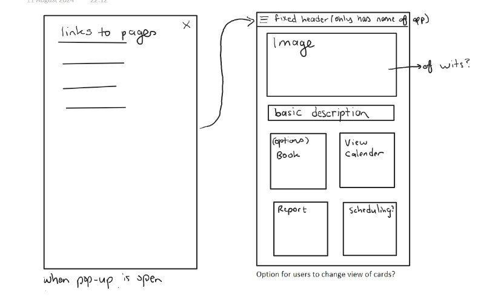

# Development Process :gear:

## Planning of Architecture

At the begining of the process we focused on the technology choices, the high-level view of the system and the database and API specifications. Then we added more detail to the planning of the key features.

The project architecture is: Multi-tier architecture

We chose this architecture as we have a front-end, a web hosting server, api and backend NO-SQL database.

The technology stack is:

- Frontend: HTML, CSS , Tailwind - (This is good for mobile-first development)
- Authentication: OAuth, and Firebase authentication
- Backend: Node Js, Express Js
- Databases: Firebase Firestore

Some frequently asked questions:
- Why use Firestore NOSQL database: It is good for mobile development due to its flexibility and scalability. It has real time data sychronisation and is very customisable in its security rules.
    (ref: https://cloud.google.com/blog/topics/developers-practitioners/all-you-need-know-about-firestore-cheatsheet)
- Why use an API with a firestore NOSQL database: So that other sub-systems do not have to get involved with our database, they can just call our API and acess our data with the correct authentication.

It was important that we hosted our website in our home country: Since our application was designed for use by our university it is important that everything is hosted as close to our country as possible. So we hosted our database and our web server in our country.

## Diagrams

### Use Case Diagram

The Use case diagram to illustrate basic features.
.png)

### Deployment Diagram

The Deployment diagram to illustrate how our website deploys.
.png)

### Component Diagram

The system components can be seen below in the component diagram.

## UI/UX Design Process

We focused on the mobile design first as our website application is more geared to the mobile first aproach.

### Wireframes <!-- {docsify-ignore} -->

We did a couple of wireframes in order to perfect our design.

Login

Home

### Mockups <!-- {docsify-ignore} -->

The Mockups based off of the wireframes (but also more refinied)

Revised mockup designs based on the clients feedback.

### Desktop mockups

#### Use case: User books a venue

> Frame 1:
> 
> Frame 2:
> 
> Frame 3:
> 
> Frame 4:
> 
> Frame 5:
> 
> Frame 6:
> 
> Frame 7:
> 

#### Use case: General user main dashboard
> Frame 1:
> 
> Frame 2:
> 

#### Use case: Onboarding Pages
> 

#### Use case: General maintenance reports and logs

### Prototypes <!-- {docsify-ignore} -->

### Details on Frontend Components

- Fonts:
- Main Colours: Wits colours
  - Blue: #003B5C
  - Gold: #917248
- Colour Tints:
  - Lighter blue when hovering: #01517d
  - Darker gold when hovering: #806541
  
Button Specification:
- Primary Button: Gold
- Secondary Button: Blue

Background Specification:
- Blue for headers
- Otherwise white(#ffffff)

## Key Features Overview

- Book venues: Users can book various venues. Lecturers can book most venues such as classes and lecture halls, students who are not tutors can only book study rooms, and students who are tutors can book tutorial rooms in addition to study rooms.
- Schedule Integration: Lecturers can integrate there schedules to make automatic bookings for there classes.
- Maintenence Reports: Users can report whether a room requires maintenence and Staff can view these in order to resolve them.
- Notifications: Users except staff can recieve booking notifications whilst staff can recieve maintenence notifications.

### Implementation of the key features Overview

The specifications for their respective databases and API endpoints are shown further below.

### Basics of implementing the key features

- First we will implement the prototype via html, css and tailwind.
- Then the API's and the Databases will be created and implemented based on their respective specifications.
- We will create the Js functions to make use of the API calls and link with the database.
- Create tests around Js functions.

## Integration with Other Systems Overview

- Transport App: Map API for navigation to venues.
- Events and Activities App: Call their API to find out if any venues are booked for an event or activity - to make sure we are synchronised.
- Campus Safety App: Call their API to provide emergency contact information.
- Dining Services: Book reservations through our app.

## Timelines

- 8th -20th Auguast - Sprint 1 -Plan the software (UI/UX and architecture)
- 20th August - 1st Marking
- 20th -27th August - Sprint 2 - begin programming the key features - DB, API, Frontend.
- 27th August -3rd September - Sprint 3 - finalise APIs, finalise integration plans, Create frontend pages(user dashboard, other pages).
- 4th - 10th September - Sprint 4 - Begin implementing core features, finalise frontend pages, secure API, integrate with other systems.
- 11th - 16th September - Sprint 5 - Begin Unit and Integration Testing of the core features, Stub integrations if have not recieved their API access.
- 17th September - 2nd Marking
- 01st October - 3rd Marking
- 07th October - Group Report and Documentation
- 08-17th October - Demo
- 20th October - Individual Reports

---
