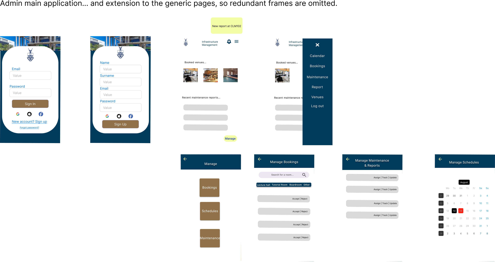

# Development Process :gear:

## Planning of Architecture

At the initial stage of the project we decided that we would employ a multi-tier architecture. This architecture was well suited to our project as we would need a front-end, a web hosting server, an Application Programming Interface (API) and a backend NO-SQL database.    

The reason we employed a NO-SQL database is due to the fact that they are offer high availability, performance and scalability. These features allow for our website to handle high levels of user traffic so that we can remain always online with our products services [1]. 

Furthermore, we had to decide on the NO-SQL database that we would employ.  As a group we went with the Firebase Firestore database as it is good for mobile development (which we had to account for due to responsive design principles) and scalability [2]. Firestore has real time data synchronisation [2] which would allow for our website to update its content quickly when new database entries and deletions occur. 

We decided to use an API with the Firestore database as we had to integrate with other subsystems and could not expect them to initialise our database infrastructure on their web applications. By using an API other teams could simply access our venue management data without fuss over the inner workings of the database. 

The website was hosted on Microsoft Azure as a web application as it was a service we as a team were most familiar with. Furthermore, the service offers services such as support for multiple languages such as Node.js, GitHub CI/CD pipeline integration and we would not have to worry about the finer details of hosting a web application as that would be managed by Azure [3].  Additionally, an important consideration was that our website needed to be hosted in our home country. This was to promote a good latency for University of Witwatersrand staff and students when using our website. Thankfully Azure has support for hosting the website from South Africa. 

The technology stack we used is:
- Frontend: HTML, CSS , Tailwind - (This is good for mobile-first development)
- Authentication: OAuth, and Firebase authentication
- Backend: Node Js, Express Js
- Databases: Firebase Firestore

## Diagrams
To help us illustrate the flow of our systems and their interactions we created a Component, Use case and a Deployment diagram [Figure].  
### Use Case Diagram

The Use case diagram to illustrate basic features.
.png)

### Deployment Diagram

The Deployment diagram to illustrate how our website deploys.
.png)

### Component Diagram

The system components can be seen below in the component diagram.

## UI/UX Design Process

We focused on the mobile design first as our website application is more geared to the mobile first aproach.

### Wireframes <!-- {docsify-ignore} -->

We did a couple of wireframes in order to perfect our design.

Login

Home

### Mockups <!-- {docsify-ignore} -->

The Mockups based off of the wireframes (but also more refinied)

Revised mockup designs based on the clients feedback.

### Desktop mockups

#### Use case: User books a venue

> Frame 1:
> 
> Frame 2:
> 
> Frame 3:
> 
> Frame 4:
> 
> Frame 5:
> 
> Frame 6:
> 
> Frame 7:
> 

#### Use case: General user main dashboard
> Frame 1:
> 
> Frame 2:
> 

#### Use case: Onboarding Pages
> 

#### Use case: General maintenance reports and logs

### Prototypes <!-- {docsify-ignore} -->

### Details on Frontend Components

- Fonts:
- Main Colours: Wits colours
  - Blue: #003B5C
  - Gold: #917248
- Colour Tints:
  - Lighter blue when hovering: #01517d
  - Darker gold when hovering: #806541
  
Button Specification:
- Primary Button: Gold
- Secondary Button: Blue

Background Specification:
- Blue for headers
- Otherwise white(#ffffff)

### User stories
- As a user, I want to be able to log in to the app so that i can make bookings.
- As a user, I want to be able to use GoogleAuth so that the logging in process in simpler.
- As a user, I want to be able to be able to specify my role so that I can access the right functionality.
- As a user, I want to be able to view all venues so that I can choose one to book.
- As a user, I want to be able to view all my upcoming bookings so that I will not forget them.
- As a user, I want to be able to view all my past bookings so that I can have a record of them.
- As a user, I want to be able to view all my schedules so that I can prepare for them.
- As a user, I want to be able to add a new schedule so that I can keep my life organized.
- As a user, I want to be able to view all scheduled maintenance requests so that I can delegate them.
- As a user, I want to be able to view all in progress maintenance requests so that I can make sure they are finished.
- As a user, I want to be able to view all completed maintenance requests so that I can keep a record of them.
- As a user, I want to be able to report a maintenance issue, so that I can prevent any accidents.
- As a user, I want to be able to log out so that I can keep my information safe.
- As a user, I want to be able to receive notifications so that I can stay up to date.
- As a user, I want to be able to see security contact information so that I can contact security in case of an emergency.
- As a user, I want to be able to make a dining reservation, so that I can be sure that my place in the dining hall is booked.

## Key Features Overview

- Book venues: Users can book various venues. Lecturers can book most venues such as classes and lecture halls, students who are not tutors can only book study rooms, and students who are tutors can book tutorial rooms in addition to study rooms.
- Schedule Integration: Lecturers can integrate there schedules to make automatic bookings for there classes.
- Maintenence Reports: Users can report whether a room requires maintenence and Staff can view these in order to resolve them.
- Notifications: Users except staff can recieve booking notifications whilst staff can recieve maintenence notifications.

### Implementation of the key features Overview

The specifications for their respective databases and API endpoints are shown further below.

### Basics of implementing the key features

- First we will implement the prototype via html, css and tailwind.
- Then the API's and the Databases will be created and implemented based on their respective specifications.
- We will create the Js functions to make use of the API calls and link with the database.
- Create tests around Js functions.

## Integration with Other Systems Overview

- Transport App: Map API for navigation to venues.
- Events and Activities App: Call their API to find out if any venues are booked for an event or activity - to make sure we are synchronised.
- Campus Safety App: Call their API to provide emergency contact information.
- Dining Services: Book reservations through our app.

## Timelines

- 8th -20th Auguast - Sprint 1 -Plan the software (UI/UX and architecture)
- 20th August - 1st Marking
- 20th -27th August - Sprint 2 - begin programming the key features - DB, API, Frontend.
- 27th August -3rd September - Sprint 3 - finalise APIs, finalise integration plans, Create frontend pages(user dashboard, other pages).
- 4th - 10th September - Sprint 4 - Begin implementing core features, finalise frontend pages, secure API, integrate with other systems and Incorporate user feedback.
- 11th - 16th September - Sprint 5 - Begin Unit and Integration Testing of the core features, Stub integrations if have not recieved their API access.
- 17th September - 2nd Marking
- 18th - 24th Sepetember - Sprint 6 - begin implementing system wide coverage of testing, Work on integrations with other groups (stubbing or the use of their API's). Refine core features. Refine design and incorporate any user feedback.
- 25th Sepetember - 3rd October - Sprint 7 - Finalise All testing and the websites features and functionality.
- 04th October - 3rd Marking
- 07th October - Individual Reports
- 08-17th October - Demo
- 17th October - Group Report

## Important Client Feedback:
- Different colour scheme from initial design
- Recomends tailwind (we used it)
- Website needs a whitelist
- ticket system for maintenace logs.
- Onboarding process
- Do not need sign up page.
- changing/ fixing the back buttons.
- Mock API's instead of hardcoding it.
- implement use of API key tracking.

---
