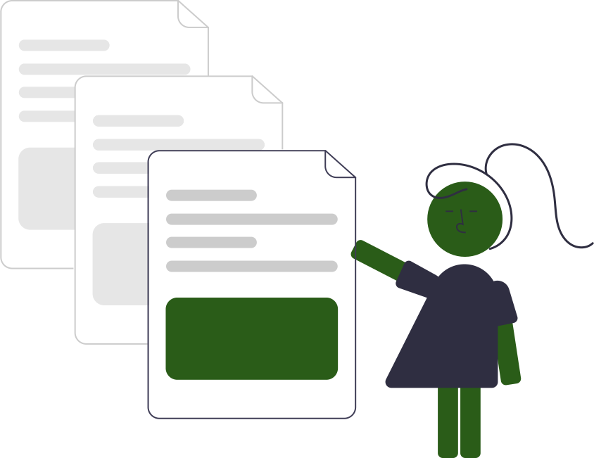
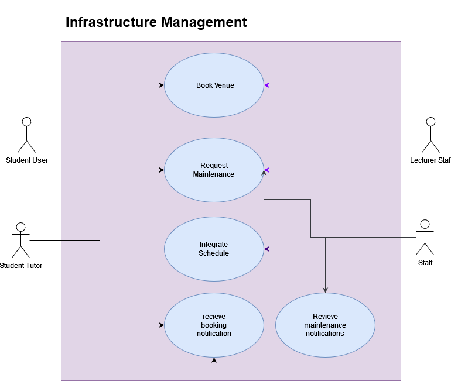
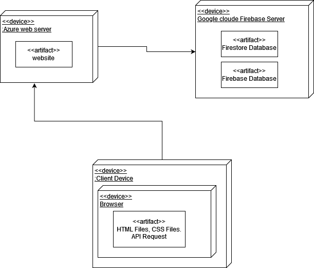
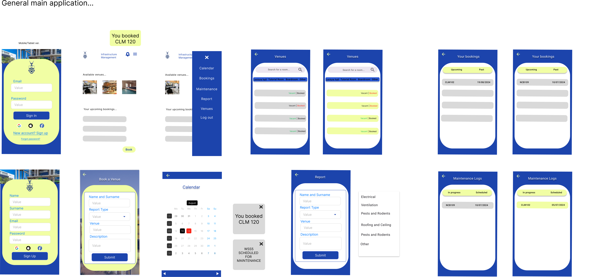
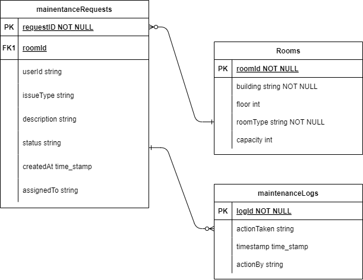

# Welcome to Campus Infrastructure Management Docs! :paperclips:
https://witsgroup-1.github.io/campus-infrastructure-management-docs/
---

<p style="text-align: center;">
    
</p>

---

> **Made By Group -1:**<br>
> Dineo Chiloane (2563191) :woman_technologist:<br>
> Claire Newman (2549861) :woman_technologist:<br>
> Chloe Dube(2602515) :woman_technologist:<br>
> Mayuri Balakistan (2543986) :woman_technologist: <br>
> Busisiwe Vemba (2561620) :woman_technologist:<br>
> Menzi Shazi (2453308) :man_technologist:<br>

# Introduction :book:

The Classroom/Venue Management App is designed to enhance the efficiency of managing classroom and venue assignments, bookings, and maintenance on campus. This application integrates seamlessly with academic schedules, providing a centralized platform for room bookings, maintenance issue reporting, and schedule management.

Key features include a room booking system that allows users to reserve classrooms and venues for various purposes, a visual availability calendar for easy schedule viewing, and a notification system to keep users informed of upcoming bookings and updates. The app also supports an admin interface for managing schedules and maintenance tasks, ensuring that all aspects of campus venue management are handled efficiently.

While push notifications are a stretch goal, the app’s secure and scalable infrastructure is built to ensure data integrity and availability. The user-friendly dashboard and robust APIs for booking, scheduling, maintenance, notifications, and user management together provide a comprehensive solution for optimizing space utilization on campus.

---

# Development Process :gear:

## Planning of Architecture
At the begining of the process we focused on the technology choices, the high-level view of the system and the database and API specifications. Then we added more detail to the planning of the key features.



The initial project architecture is: Multi-tier architecture

We chose this architecture as we have a front-end, a web hosting server, api and backend NO-SQL database.

Here is the deployment diagram to illustrate how our website deploys.



The system components can be seen below in the component diagram.


## UI/UX Design Process

### Wireframes

We did a couple of wireframes in order to perfect our design.

Login


Home


### Mockups



### Prototypes


## Key Features
- Book venues: Users can book various venues. Lecturers can book most venues such as classes and lecture halls, whilst tutors can book tutorial rooms and users can book them as well.
- Schedule Integration: Lecturers can integrate there schedules to make automatic bookings for there classes.
- Maintenence Reports: Users can report whether a room requires maintenence and Staff can view these in order to resolve them.
- Notifications: Users except staff can recieve notifications whilst staff can recieve maintenence notifications. 


## Integration with Other Systems
- Events and Activities App: Call their API to find out if any venues are booked for an event or activity.
- Campus Safety App: Call their API to provide emergency contact information

## Timelines


---

# Component Details :wrench:

---

# API Specifications :memo:

## User Management API :bust_in_silhouette:

## Booking API :calendar:

<iframe src="./swagger/swagger-ui.html" width="100%" height="800px"></iframe>


## Schedule API :watch:

## Maintenance API :hammer_and_wrench:

## Notification API :bell:

---

# Database Schema :floppy_disk:

For our project, we use a **Hierarchical Model**, which organizes data in a “tree-like” structure with parent-child relationships. Our chosen database, Firebase Firestore, uses this hierarchical model to effectively manage and scale our data.

## User Database :file_folder:

**Users Collection**

**1. Collection**: `users`

**Document**: `{userId}` (Document ID is a unique identifier for each user, such as `firebase_uid`)

**Document Fields:**

- `name`: User’s first name (string)
- `surname`: User’s last name (string)
- `email`: User’s email address (string)
- `role`: User’s role (string) – e.g., student, or staff
- `faculty`: User’s faculty or department (string)
- `is_tutor`: Indicates if the user is a tutor (boolean)
- `is_lecturer`: Indicates if the user is a lecturer (boolean)

**Example Document:** <br>
In the example below, the user should be able to make venue bookings since the `is_lecturer` field is set to `true`. If it was set to `false`, they would not have the priviledge to book venues.

> ```json
> {
>   "name": "John",
>   "surname": "Doe",
>   "email": "john.doe@wits.ac.za",
>   "role": "staff",
>   "faculty": "science",
>   "is_tutor": false,
>   "is_lecturer": true
> }
> ```

**Example Document:** <br>
In the following example, the user should be able to make bookings since the `is_tutor` field is set to `true`. If it was set to `false`, they would not have the priviledge to book venues.


> ```json
> {
>   "name": "Mitsy",
>   "surname": "Nkuna",
>   "email": "2538929632@students.wits.ac.za",
>   "role": "student",
>   "faculty": "science",
>   "is_tutor": true,
>   "is_lecturer": true
> }
> ```

**2. Bookings Subcollection**

**Subcollection**: `bookings` (inside each user document)

**Document**: `{bookingId}` (Document ID for each booking)

**Document Fields:**

- `room`: The unique identifier for the room (string) – e.g., `wss1`
- `start_time`: The start time of the booking (timestamp)
- `end_time`: The end time of the booking (timestamp)
- `booker_id`: The email of the user who made the booking (string)

**Example Document**

> ```json
> {
>   "room": "wss1",
>   "start_time": "2024-10-19T10:15:00Z",
>   "end_time": "2024-10-19T11:00:00Z",
>   "booker_id": "john.doe@wits.ac.za"
> }
> ```

**3. Courses Subcollection**

**Subcollection**: `courses` (inside each user document)

**Document**: `{courseId}` (Document ID for each course)

**Document Fields:**

- `course_code`: The code of the course (string) – e.g., `COMS1018A`
- `lecturer_email`: The email of the course instructor, since they are responsible for making the booking. (string) – e.g., `john.doe@wits.ac.za`

**Example Document:**

> ```json
> {
>   "course_code": "COMS1018A",
>   "lecturer_email": "john.doe@wits.ac.za"
> }
> ```

**Summary of Schema Structure**


---

---

## Booking Database :clipboard:

**1. Bookings Collection**

**Collection Name:** `bookings`

**Documents:** Each document represents a booking and is identified by a unique `bookingId`.

**Document Fields:**

- **`bookingId`** (String, **Unique Identifier**): A unique identifier for each booking.
- **`venueId`** (String, **Foreign Key**): The unique identifier of the venue being booked.
- **`roomID`**(String, **Foreign Key**): The unique identifier of the room being booked.
- **`userId`** (String, **Foreign Key**): The unique identifier of the user who made the booking.
- **`start_time`** (Timestamp): The start time of the booking (ISO 8601 format).
- **`end_time`** (Timestamp): The end time of the booking (ISO 8601 format).
- **`purpose`** (String, Optional): The purpose of the booking.
- **`status`** (String): The status of the booking (e.g., "Confirmed", "Pending", "Cancelled").

**Example Document:**

```json
{
  "bookingId": "1234",
  "venueId": "0001",
  "roomID":"100",
  "userId": "1000",
  "start_time": "2024-08-14T09:00:00Z",
  "end_time": "2024-08-14T10:00:00Z",
  "purpose": "SDP Lecture",
  "status": "Confirmed"
}
```

---

**2. Venues Collection**

**Collection Name:** `venues`

**Documents:** Each document represents a venue and is identified by a unique `venueId`.

**Document Fields:**

- **`venueId`** (String, **Unique Identifier**): A unique identifier for each venue.
- **`name`** (String): The name of the venue.


**Example Document:**

```json
{
  "venueId": "0001",
  "name": "FNB Building",
}


```

**Subcollection:** `rooms` (inside each venue document)

**Document:** `{roomId}` (Document ID, unique identifier for each room)

**Document Fields:**

`room_id`: Unique identifier for the venue (string, generated by Firebase)
`name`: Actual name of the room (string)
`location`: Physical location of the room within the venue (string)
`capacity`: Maximum number of people the room can accommodate (integer)
`features`: List of features available in that room  (array of strings, optional)

**Document Example**:

```json
{
  "room_id": "001",
  "name": "FNB 37",
  "location": "Floor 1, FNB Building",
  "capacity": 40,
  "features": ["Projector", "Whiteboard", "Wi-Fi"]
}

```
**Summary of Schema Structure**


---

## Schedule Database :calendar:
**Schedule Collection**

**1. Collection** : `schedules`

**Document** : `{scheduleId}`

**Document Fields** :
 
 - `roomId` (string): the room/venue where the lesson will take place.
 - `courseId` (string): the course that will be taught.
 - `startTime` (timestamp): the time at which the lesson begins.
 - `endTime` (timestamp): the time at which the lesson ends.
 - `daysOfWeek` (string): the days on which the lesson takes place.
 - `startDate` (timestamp): the date on which the lessons begin.
 - `endDate` (timestamp): the date on which the lessons end.
 - `recurring` (boolean): indicates whether the lesson recurs on a timely basis.
 - `userId` (string): the identifier for the lecturer that created the schedule. (Only lecturers can create schedules.)

 **Example Document:** <br>

>```json
>{
>  "roomId": "Room101",
>  "courseId": "COMS3011A",
>  "startTime": "10:00",
>  "endTime": "12:00",
>  "daysOfWeek": "Monday",
>  "startDate": "24 January 2024",
>  "endDate": "8 June 2024",
>  "recurring": "True",
>  "userId": "Lecturer1923"
>}
>```

**2. Subcollection** : `rooms`

The `rooms` subcollection is found inside every `schedule` collection. It contains the details of the room that is being booked for a particular course.

**Document** : `{roomsId}`

 **Document Fields:**

- `roomId` (String): The identifier for the room or venue.
- `building` (String): The building where the room is located.
- `floor` (String): The floor on which the room is located.
- `roomType` (String): The type of room.
- `capacity` (Number): The capacity of the room.

 **Example Document:**

>```json
>{
>  "roomId": "Room101",
>  "building": "Science Building",
>  "floor": "2nd",
>  "roomType": "Tutorial Room",
>  "capacity": 20,
>}
>```

**Reference** : `courses`

The `schedules` collection makes reference to the `courses` subcollection. This subcollection specifies which course the lecturer will teach in that time slot.

**Document**: `{courseId}`

**Document Fields:**

- `course_code`: (string) The code of the course.
- `lecturer_email`: (string) The email of the course instructor that created the schedule.

**Example Document:**

> ```json
> {
>   "course_code": "COMS3011A",
>   "lecturer_email": "adamwhite@wits.ac.za"
> }
> ```

**Summary of Schema Structure**


## Maintenance Database :hammer_and_wrench:
**Maintenance Collection**

**1. Collection** : `maintenanceRequests`
**Document**: `{requestId}`

**Document fields**:

- `roomId` (String): Identifier for the room or venue where the issue was reported.
- `userId` (String): Unique identifier for the user who reported the issue (e.g., firebase_uid).
- `issueType` (String): The type of issue reported – e.g., "Electrical," "Plumbing."
- `description` (Text): Detailed description of the issue.
- `status` (String): Current status of the request – e.g., "Open," "In Progress," "Resolved."
- `createdAt` (Timestamp): Date and time when the request was created.
- `assignedTo` (String): Identifier for the staff member assigned to the request.

**Example Document:** <br>

>```json
>{
>  "roomId": "Room101",
>  "userId": "User123",
>  "issueType": "Electrical",
>  "description": "Light not working",
>  "status": "Open",
>  "createdAt": "2024-08-12T09:00:00Z",
>  "assignedTo": "Staff456"
>}
>```

**2. Subcollection: `maintenanceLogs`**

This subcollection is found inside each `maintenanceRequests` document. It tracks the history of actions taken on the request.
**Document**: `{logId}`

**Document Fields:**
- `logId` (String): Unique identifier for the log entry.
- `actionTaken` (String): Description of the action – e.g., "Request created," "Status changed to In Progress."
- `actionBy` (String): Identifier for the user who performed the action.
- `timestamp` (Timestamp): Date and time when the action was taken.

**Example Document:** <br>

>```json
>{
>  "logId": "Log001",
>  "actionTaken": "Request created",
>  "actionBy": "User123",
>  "timestamp": "2024-08-12T09:01:00Z"
>}
>```

**3. Subcollection: `rooms`**

This subcollection is found inside each `maintenanceRequests` document. It contains information about the room or venue related to the maintenance request. This is useful if the room details need to be recorded separately or if multiple rooms are associated with a single maintenance request.

**Document**:`roomId`

 **Document Fields:**
- `roomId` (String): Unique identifier for the room or venue – e.g., "Room101."
- `building` (String): The building where the room is located – e.g., "Science Building."
- `floor` (String): The floor on which the room is located.
- `roomType` (String): The type of room – e.g., "Classroom," "Lecture Hall," "Lab."
- `capacity` (Number): The capacity of the room – e.g., 30 students.

 **Example Document:**

>```json
>{
>  "roomId": "Room101",
>  "building": "Science Building",
>  "floor": "1st",
>  "roomType": "Classroom",
>  "capacity": 30,
>}
>```

**Overall Structure:**

- **`maintenanceRequests` (Main Collection)**
  - **`requestId1` (Document)**
    - `roomId`: "Room101"
    - `userId`: "User123"
    - `issueType`: "Electrical"
    - `description`: "Light not working"
    - `status`: "Open"
    - `createdAt`: "2024-08-12T09:00:00Z"
    - `assignedTo`: "Staff456"
    - **`rooms` (Subcollection)**
      - `roomId1` (Document)
        - `roomId`: "Room101"
        - `building`: "Science Building"
        - `floor`: "1st"
        - `roomType`: "Classroom"
        - `capacity`: 30
    - **`maintenanceLogs` (Subcollection)**
      - `logId1` (Document)
        - `actionTaken`: "Request created"
        - `actionBy`: "User123"
        - `timestamp`: "2024-08-12T09:01:00Z"

**Summary:**

- **Main Collection: `maintenanceRequests`**
  - Stores general information about each maintenance request.

- **Subcollection: `rooms`**
  - Contains details about the specific room(s) involved in the maintenance request.

- **Subcollection: `maintenanceLogs`**
  - Tracks the history of actions taken related to the maintenance request.


**Summary of schema structure:**



# Testing and Quality Assurance :test_tube:

---

# Deployment and Integration :rocket:

---

# Challenges and Solutions :thinking:

---

# Conclusion and Future Work :trophy:

---

# Appendices :file_cabinet:

```

```
