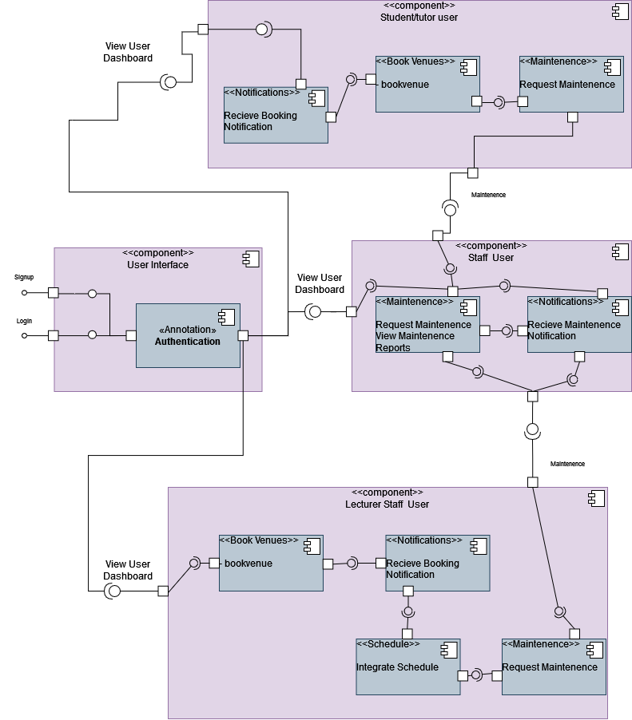
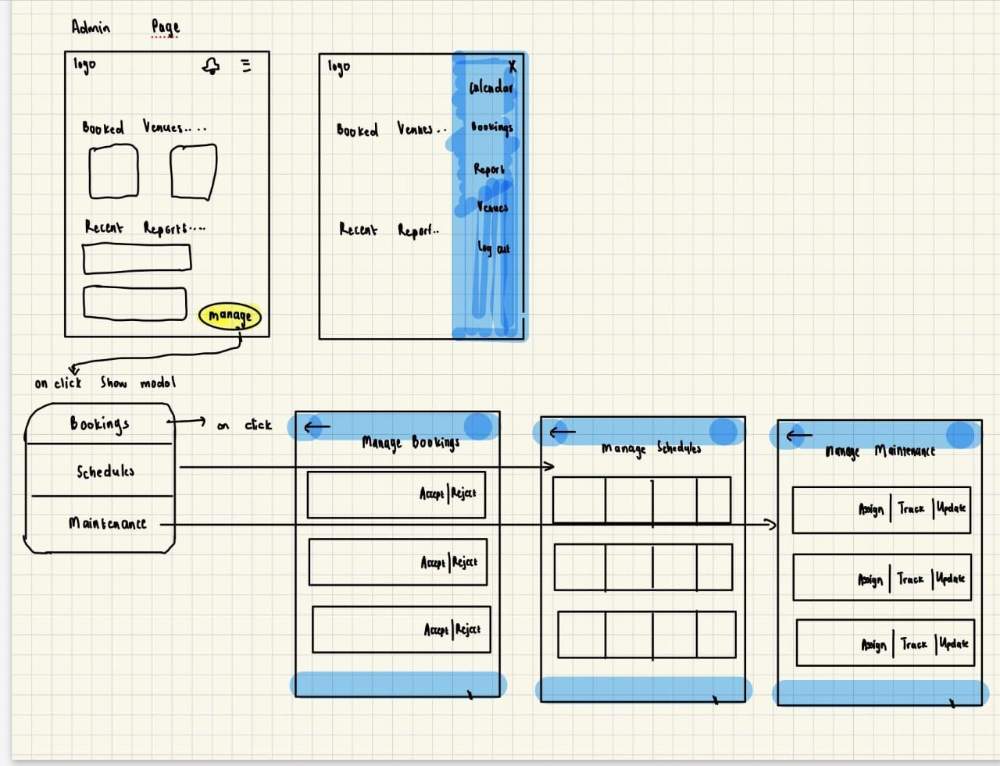

# Welcome to Campus Infrastructure Management Docs! :paperclips:
<!-- https://witsgroup-1.github.io/campus-infrastructure-management-docs/ -->
---

<p style="text-align: center;">
    
</p>

---

> **Made By Group -1:**<br>
> Dineo Chiloane (2563191) :woman_technologist:<br>
> Claire Newman (2549861) :woman_technologist:<br>
> Chloe Dube(2602515) :woman_technologist:<br>
> Mayuri Balakistan (2543986) :woman_technologist: <br>
> Busisiwe Vemba (2561620) :woman_technologist:<br>
> Menzi Shazi (2453308) :man_technologist:<br>

# Introduction :book:

The Classroom/Venue Management App is designed to enhance the efficiency of managing classroom and venue assignments, bookings, and maintenance on campus. This application integrates seamlessly with academic schedules, providing a centralized platform for room bookings, maintenance issue reporting, and schedule management.

Key features include a room booking system that allows users to reserve classrooms and venues for various purposes, a visual availability calendar for easy schedule viewing, and a notification system to keep users informed of upcoming bookings and updates. The app also supports an admin interface for managing schedules and maintenance tasks, ensuring that all aspects of campus venue management are handled efficiently.

While push notifications are a stretch goal, the app’s secure and scalable infrastructure is built to ensure data integrity and availability. The user-friendly dashboard and robust APIs for booking, scheduling, maintenance, notifications, and user management together provide a comprehensive solution for optimizing space utilization on campus.

## Important Links
- Code Repository: https://github.com/witsgroup-1/campus-infrastructure-management
- Documentation Repository: https://github.com/witsgroup-1/campus-infrastructure-management-docs
- Documentation Website: https://witsgroup-1.github.io/campus-infrastructure-management-docs/#/?id=welcome-to-campus-infrastructure-management-docs-paperclips
---

# Development Process :gear:

## Planning of Architecture 
At the begining of the process we focused on the technology choices, the high-level view of the system and the database and API specifications. Then we added more detail to the planning of the key features.

The project architecture is: Multi-tier architecture

We chose this architecture as we have a front-end, a web hosting server, api and backend NO-SQL database.

The technology stack is: 
- Frontend: HTML, CSS , Tailwind  - (This is good for mobile-first development)
- Backend: Node Js, Express Js 
- Databases: Firebase, Firebase Firestore 


## Diagrans

### Use Case Diagram
The Use case diagram to illustrate basic features.


### Deployment Diagram
The Deployment diagram to illustrate how our website deploys.


### Component Diagram
The system components can be seen below in the component diagram.



## UI/UX Design Process

We foucsed on the mobile design first as our website application is more geared to the mobile first aproach.

### Wireframes  <!-- {docsify-ignore} -->

We did a couple of wireframes in order to perfect our design.

Login


Home




### Mockups  <!-- {docsify-ignore} -->
The Mockups based off of the wireframes (but also more refinied)


### Prototypes  <!-- {docsify-ignore} -->


## Key Features
- Book venues: Users can book various venues. Lecturers can book most venues such as classes and lecture halls, whilst tutors and students can book tutorial rooms.
- Schedule Integration: Lecturers can integrate there schedules to make automatic bookings for there classes.
- Maintenence Reports: Users can report whether a room requires maintenence and Staff can view these in order to resolve them.
- Notifications: Users except staff can recieve booking notifications whilst staff can recieve maintenence notifications. 


### Implementation of the key features

The specifications for their respective databases and API endpoints are shown below.

#### Basics of implementing the key features
- First we will implement the prototype via html, css and tailwind.
- Then the API's and the Databases will be created and implemented based on their respective specifications.
- We will create the Js functions to make use of the API calls and link with the database.
- Create tests around Js functions.


## Integration with Other Systems
- Events and Activities App: Call their API to find out if any venues are booked for an event or activity.
- Campus Safety App: Call their API to provide emergency contact information


## Timelines
- 8th -20th Auguast - Plan the software (UI/UX and architecture)
- 20th August - 1st Marking
- 20th -26th August - begin programming the key features - DB, API, Frontend.
- 17th September - 2nd Marking
- 01st October - 3rd Marking
- 07th October - Group Report and Documentation 
- 08-17th October - Demo
- 20th October - Individual Reports

---

# Component Details :wrench:

---

# API Specifications :memo:

## User Management API :bust_in_silhouette:

<iframe src="./swagger/user-api.html" width="100%" height="800px"></iframe>

## Booking API :calendar:

<iframe src="./swagger/booking-api.html" width="100%" height="800px"></iframe>


## Schedule API :watch:

<iframe src="./swagger/schedule-api.html" width="100%" height="800px"></iframe>


## Maintenance API :hammer_and_wrench:

<iframe src="./swagger/maintenance-api.html" width="100%" height="800px"></iframe>

## Notification API :bell: 

### Purpose  <!-- {docsify-ignore} -->

The Notification API handles the scheduling and delivery of notifications to users, including reminders for upcoming bookings and updates on maintenance requests.

### Endpoints  <!-- {docsify-ignore} -->

#### Create Notification  <!-- {docsify-ignore} -->

* **Endpoint:** `POST /api/notifications`
* **Description:** Create a new notification to be sent at a specific time.
* **Request Body:**
```json
{
  "userId": "Lecturer1923",
  "type": "booking_reminder",
  "message": "Reminder: Your booking for Room101 starts in 30 minutes.",
  "sendAt": "2024-08-19T09:30:00Z"
}
```
* **Response:**
```json
{
  "notificationId": "notif123",
  "message": "Notification scheduled successfully."
}
```

#### Get Notifications for User  <!-- {docsify-ignore} -->

* **Endpoint:** `GET /api/notifications/user/{userId}`
* **Description:** Retrieve all notifications scheduled for a specific user.
* **Response:**
```json
[
  {
    "notificationId": "notif123",
    "type": "booking_reminder",
    "message": "Reminder: Your booking for Room101 starts in 30 minutes.",
    "sendAt": "2024-08-19T09:30:00Z"
  },
  ...
]
```

#### Update Notification  <!-- {docsify-ignore} -->

* **Endpoint:** `PUT /api/notifications/{notificationId}`
* **Description:** Update an existing notification (e.g., change the message or send time).
* **Request Body:**
```json
{
  "message": "Reminder: Your booking for Room101 starts in 15 minutes.",
  "sendAt": "2024-08-19T09:45:00Z"
}
```
* **Response:**
```json
{
  "notificationId": "notif123",
  "message": "Notification updated successfully."
}
```

#### Delete Notification  <!-- {docsify-ignore} -->

* **Endpoint:** `DELETE /api/notifications/{notificationId}`
* **Description:** Delete a scheduled notification.
* **Response:**
```json
{
  "message": "Notification deleted successfully."
}
```

#### Send Immediate Notification  <!-- {docsify-ignore} -->

* **Endpoint:** `POST /api/notifications/send`
* **Description:** Send a notification immediately without scheduling.
* **Request Body:**
```json
{
  "userId": "Lecturer1923",
  "type": "booking_reminder",
  "message": "Immediate notification: Your booking for Room101 is starting now."
}
```
* **Response:**
```json
{
  "notificationId": "notif124",
  "message": "Notification sent successfully."
}
```


# Database Schema :floppy_disk:

For our project, we use a **Hierarchical Model**, which organizes data in a “tree-like” structure with parent-child relationships. Our chosen database, Firebase Firestore, uses this hierarchical model to effectively manage and scale our data.

## User Database :file_folder:

**Users Collection**

**1. Collection**: `users`

**Document**: `{userId}` (Document ID is a unique identifier for each user, such as `firebase_uid`)

**Document Fields:**

- `name`: User’s first name (string)
- `surname`: User’s last name (string)
- `email`: User’s Wits email address (string)
- `role`: User’s role (string) – e.g., student, or staff
- `faculty`: User’s faculty or department (string)
- `is_tutor`: Indicates if the user is a tutor (boolean)
- `is_lecturer`: Indicates if the user is a lecturer (boolean)
- `{bookings}`: Contains all the bookings that the user made in the form of documents(collection).
-`{courses}`: Contains all the user's courses in the form of documents(collection).

**Example Document:** <br>
In the example below, the `staff` user should be able to make bookings for lecture halls, meeting rooms, tutorial rooms, and exam venues since the `is_lecturer` field is set to `true`. If it was set to `false`, they would not have the priviledge to do so.
> ```json
> {
>   "name": "John",
>   "surname": "Doe",
>   "email": "john.doe@wits.ac.za",
>   "role": "staff",
>   "faculty": "science",
>   "is_tutor": false,
>   "is_lecturer": true,
>   {bookings},
>   {courses}
> }
> ```

**Example Document:** <br>
In the following example, the student user should be able to make bookings for tutorial rooms since the `is_tutor` field is set to `true`.


> ```json
> {
>   "name": "Mitsy",
>   "surname": "Nkuna",
>   "email": "2538929632@students.wits.ac.za",
>   "role": "student",
>   "faculty": "science",
>   "is_tutor": true,
>   "is_lecturer": true,
>   {bookings},
>   {courses}
> }
> ```


**Example Document:** <br>
In the following example, the student user should be able to make bookings for study rooms only since the `is_tutor` field is set to `false`. 


> ```json
> {
>   "name": "Mitsy",
>   "surname": "Nkuna",
>   "email": "2538929632@students.wits.ac.za",
>   "role": "student",
>   "faculty": "science",
>   "is_tutor": false,
>   "is_lecturer": true,
>   {bookings},
>   {courses}
> }
> ```

**2. Bookings Subcollection**

**Subcollection**: `bookings` (inside each user document)

**Document**: `{bookingId}` (Document ID for each booking)

**Document Fields:**

- `venue_id`: The unique identifier for the venue in the collection that consists all venues on campus (string)
- `name`: The name of the venue. e.g., WSS1.
- `start_time`: The start time of the booking (timestamp)
- `end_time`: The end time of the booking (timestamp)


**Example Document**

> ```json
> {
>   "venue_id":"DcGxOJax93od7C4B8VQ8",
>   "name": "wss1",
>   "start_time": "2024-10-19T10:15:00Z",
>   "end_time": "2024-10-19T11:00:00Z",
> }
> ```

**3. Courses Subcollection**

**Subcollection**: `courses` (inside each user document)

**Document**: `{courseId}` (Document ID for each course)

**Document Fields:**

- `course_id`: The unique_id for the document belonging to that course in the collection containing all courses.
- `lecturer_id`: The `userId` for the lecturer user.

**Example Document:**

> ```json
> {
>   "course_id": "Wh89K9693odHom85230K",
>   "lecturer_id": "Hcd9xOJax93o72djh3dHgP"
> }
> ```

**Summary of Schema Structure**


---

---

## Booking Database :clipboard:

**1. Bookings Collection**

**Collection Name:** `bookings`

**Documents:** Each document represents a booking and is identified by a unique `bookingId`.

**Document Fields:**

- **`bookingId`** (String, **Unique Identifier**): A unique identifier for each booking.
- **`venueId`** (String, **Foreign Key**): The unique identifier of the venue being booked.
- **`roomID`**(String, **Foreign Key**): The unique identifier of the room being booked.
- **`userId`** (String, **Foreign Key**): The unique identifier of the user who made the booking.
- **`start_time`** (Timestamp): The start time of the booking (ISO 8601 format).
- **`end_time`** (Timestamp): The end time of the booking (ISO 8601 format).
- **`purpose`** (String, Optional): The purpose of the booking.
- **`status`** (String): The status of the booking (e.g., "Confirmed", "Pending", "Cancelled").

**Example Document:**

```json
{
  "bookingId": "1234",
  "venueId": "0001",
  "roomID":"100",
  "userId": "1000",
  "start_time": "2024-08-14T09:00:00Z",
  "end_time": "2024-08-14T10:00:00Z",
  "purpose": "SDP Lecture",
  "status": "Confirmed"
}
```

---

**2. Venues Collection**

**Collection Name:** `venues`

**Documents:** Each document represents a venue and is identified by a unique `venueId`.

**Document Fields:**

- **`venueId`** (String, **Unique Identifier**): A unique identifier for each venue.
- **`name`** (String): The name of the venue.


**Example Document:**

```json
{
  "venueId": "0001",
  "name": "FNB Building",
}


```

**Subcollection:** `rooms` (inside each venue document)

**Document:** `{roomId}` (Document ID, unique identifier for each room)

**Document Fields:**

`room_id`: Unique identifier for the venue (string, generated by Firebase)
`name`: Actual name of the room (string)
`location`: Physical location of the room within the venue (string)
`capacity`: Maximum number of people the room can accommodate (integer)
`features`: List of features available in that room  (array of strings, optional)

**Document Example**:

```json
{
  "room_id": "001",
  "name": "FNB 37",
  "location": "Floor 1, FNB Building",
  "capacity": 40,
  "features": ["Projector", "Whiteboard", "Wi-Fi"]
}

```
**Summary of Schema Structure**


---

## Schedule Database :calendar:
**Schedule Collection**

**1. Collection** : `schedules`

**Document** : `{scheduleId}`

**Document Fields** :
 
 - `roomId` (string): the room/venue where the lesson will take place.
 - `courseId` (string): the course that will be taught.
 - `startTime` (timestamp): the time at which the lesson begins.
 - `endTime` (timestamp): the time at which the lesson ends.
 - `daysOfWeek` (string): the days on which the lesson takes place.
 - `startDate` (timestamp): the date on which the lessons begin.
 - `endDate` (timestamp): the date on which the lessons end.
 - `recurring` (boolean): indicates whether the lesson recurs on a timely basis.
 - `userId` (string): the identifier for the lecturer that created the schedule. (Only lecturers can create schedules.)

 **Example Document:** <br>

>```json
>{
>  "roomId": "Room101",
>  "courseId": "COMS3011A",
>  "startTime": "10:00",
>  "endTime": "12:00",
>  "daysOfWeek": "Monday",
>  "startDate": "24 January 2024",
>  "endDate": "8 June 2024",
>  "recurring": "True",
>  "userId": "Lecturer1923"
>}
>```

**2. Subcollection** : `rooms`

The `rooms` subcollection is found inside every `schedule` collection. It contains the details of the room that is being booked for a particular course.

**Document** : `{roomsId}`

 **Document Fields:**

- `roomId` (String): The identifier for the room or venue.
- `building` (String): The building where the room is located.
- `floor` (String): The floor on which the room is located.
- `roomType` (String): The type of room.
- `capacity` (Number): The capacity of the room.

 **Example Document:**

>```json
>{
>  "roomId": "Room101",
>  "building": "Science Building",
>  "floor": "2nd",
>  "roomType": "Tutorial Room",
>  "capacity": 20,
>}
>```

**Reference** : `courses`

The `schedules` collection makes reference to the `courses` subcollection. This subcollection specifies which course the lecturer will teach in that time slot.

**Document**: `{courseId}`

**Document Fields:**

- `course_code`: (string) The code of the course.
- `lecturer_email`: (string) The email of the course instructor that created the schedule.

**Example Document:**

> ```json
> {
>   "course_code": "COMS3011A",
>   "lecturer_email": "adamwhite@wits.ac.za"
> }
> ```

**Summary of Schema Structure**


## Maintenance Database :hammer_and_wrench:
**Maintenance Collection**

**1. Collection** : `maintenanceRequests`
**Document**: `{requestId}`

**Document fields**:

- `roomId` (String): Identifier for the room or venue where the issue was reported.
- `userId` (String): Unique identifier for the user who reported the issue (e.g., firebase_uid).
- `issueType` (String): The type of issue reported – e.g., "Electrical," "Plumbing."
- `description` (Text): Detailed description of the issue.
- `status` (String): Current status of the request – e.g., "Open," "In Progress," "Resolved."
- `createdAt` (Timestamp): Date and time when the request was created.
- `assignedTo` (String): Identifier for the staff member assigned to the request.

**Example Document:** <br>

>```json
>{
>  "roomId": "Room101",
>  "userId": "User123",
>  "issueType": "Electrical",
>  "description": "Light not working",
>  "status": "Open",
>  "createdAt": "2024-08-12T09:00:00Z",
>  "assignedTo": "Staff456"
>}
>```

**2. Subcollection: `maintenanceLogs`**

This subcollection is found inside each `maintenanceRequests` document. It tracks the history of actions taken on the request.
**Document**: `{logId}`

**Document Fields:**
- `logId` (String): Unique identifier for the log entry.
- `actionTaken` (String): Description of the action – e.g., "Request created," "Status changed to In Progress."
- `actionBy` (String): Identifier for the user who performed the action.
- `timestamp` (Timestamp): Date and time when the action was taken.

**Example Document:** <br>

>```json
>{
>  "logId": "Log001",
>  "actionTaken": "Request created",
>  "actionBy": "User123",
>  "timestamp": "2024-08-12T09:01:00Z"
>}
>```

**3. Subcollection: `rooms`**

This subcollection is found inside each `maintenanceRequests` document. It contains information about the room or venue related to the maintenance request. This is useful if the room details need to be recorded separately or if multiple rooms are associated with a single maintenance request.

**Document**:`roomId`

 **Document Fields:**
- `roomId` (String): Unique identifier for the room or venue – e.g., "Room101."
- `building` (String): The building where the room is located – e.g., "Science Building."
- `floor` (String): The floor on which the room is located.
- `roomType` (String): The type of room – e.g., "Classroom," "Lecture Hall," "Lab."
- `capacity` (Number): The capacity of the room – e.g., 30 students.

 **Example Document:**

>```json
>{
>  "roomId": "Room101",
>  "building": "Science Building",
>  "floor": "1st",
>  "roomType": "Classroom",
>  "capacity": 30,
>}
>```

**Overall Structure:**

- **`maintenanceRequests` (Main Collection)**
  - **`requestId1` (Document)**
    - `roomId`: "Room101"
    - `userId`: "User123"
    - `issueType`: "Electrical"
    - `description`: "Light not working"
    - `status`: "Open"
    - `createdAt`: "2024-08-12T09:00:00Z"
    - `assignedTo`: "Staff456"
    - **`rooms` (Subcollection)**
      - `roomId1` (Document)
        - `roomId`: "Room101"
        - `building`: "Science Building"
        - `floor`: "1st"
        - `roomType`: "Classroom"
        - `capacity`: 30
    - **`maintenanceLogs` (Subcollection)**
      - `logId1` (Document)
        - `actionTaken`: "Request created"
        - `actionBy`: "User123"
        - `timestamp`: "2024-08-12T09:01:00Z"

**Summary:**

- **Main Collection: `maintenanceRequests`**
  - Stores general information about each maintenance request.

- **Subcollection: `rooms`**
  - Contains details about the specific room(s) involved in the maintenance request.

- **Subcollection: `maintenanceLogs`**
  - Tracks the history of actions taken related to the maintenance request.


**Summary of schema structure:**


# Testing and Quality Assurance :test_tube:

---
## Test Plan

- Jest was used to do testing.
- Tests will be made for functions after they are coded so we can test them before deployment.
- The test coverage reports will be uploaded to Code Cov.


# Deployment and Integration :rocket:

---
## Deployment

The website deploys via Azure Web app services using Github actions CI/CD pipeline. 

### Version Control

Version Control is mostly managed by github actions using the CI/CD pipeline - so it will record the date, time etc. 
Branch management guidlines were given to help ensure a lack of mix ups:

- Each collaborator must commit to their own respective branch (labled by their username) or the "Bugs-and-Problems" branch for any problematic code.
- Always pull new updates before you push your new updates to you respective branches.
- Make sure your tests pass before commits.
- Give your commits to your branch meaningful names including: What you did and who you are - Github actions will reflect the date and time so you do not need to worry about that.

The branch names are set as:
- main
- Bugs-and-Problems
- Chloe
- Busi
- Dineo
- Lunar
- May
- Menzi
 


# Challenges and Solutions :thinking:

---

# Conclusion and Future Work :trophy:

---

# Appendices :file_cabinet:
---

## Meeting Minutes

### Meeting 1
- Date: 09/08/2024
- Attendance: 
- Mayuri Balakistan(2543986)
- Chloe Dube (2602515)
- Claire Newman (2549861)
- Dineo Chiloane (2563191)
- Busisiwe Vemba(2561620)

- Discussion of rubric/project breakdown
- Web app must be able to resize to  fit all screens (mobile first aproach)
- Discussion of how to deal with other groups
- Work on launching “Hello World”, and starting on testing, CI/CD
- Colour Palette discussed (planning on going with Wits related colours)
- Testing: Jest 
- Database options: CosmoDB, MongoDB, Firebase, Azure. To be discussed further.
- Codecov for code coverage
- Backend: Azure
- Frontend: Html, css and perhaps bootstrap (to be discussed further).

- Questions:
- Only 3rd party providers?
- One database for entire system or each group own database?

- Plan of action
- Design website
- Configure CI/CD pipeline and testing
- Plan API endpoints, schemas
- Deploy Hello World website


### Meeting 2 
- Date: 13/08/2024
- Attendees:
- Mayuri Balakistan(2543986)
- Chloe Dube (2602515)
- Claire Newman ()
- Dineo Chiloane (2563191)
- Busisiwe Vemba(2561620)
- Menzi Shazi(2453308)
- The Client 

- Issues with website deployment
- Must focus on API specifications, designs and database schemas.

- Discussion with client:
- Colour palette: Wits colours, dark mode if possible.
- Integration: design API in a way that is useful to other groups, make sure our app does not fail if another API were to fail.
- UI/UX: discussed the 60,30,10 rule, the use of Tailwind and consistency of text size. 
- Users: staff, students, admin. Use of wits email and whitelist.
- Client’s requests: heat map for booking (stretch goal), ticket system, dark mode, and more filters for choosing rooms, separated documents (i.e. API documentation separate from database documentation).

### Meeting 3
- Date: 18 August 2024
- Attendees:
- Mayuri Balakistan(2543986)
- Chloe Dube (2602515)
- Claire Newman (2549861)
- Dineo Chiloane (2563191)
- Busisiwe Vemba(2561620)
- Menzi Shazi(2453308)

- Resolved issue with app deployment.
- In progress of completing API specifications and database schemas.
- Decided on tech stack: 
-	Backend: Azure, JavaScript, Node.js
- 	Frontend: HTML, CSS, Tailwind
-	Database: Firebase
- Decided which other APIs to make use of:
-	Events API
-   Campus Security API
- Issues to keep an eye on moving forward: working around other subsystems

