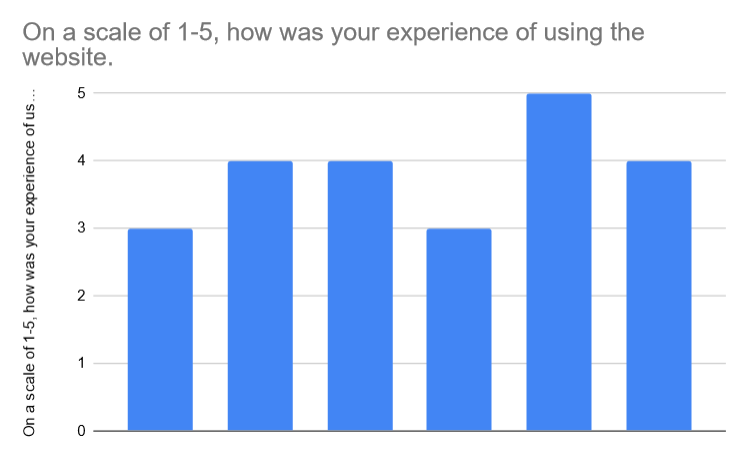

# Testing and Quality Assurance :test_tube:

---

## Test Plan

- Jest was used to do testing.
- Tests will be made for functions after they are coded so we can test them before deployment.
- There will be unit tests and integration tests.
- The test coverage reports will be uploaded to CodeCov.

## Tests
### Testing for editBookings.js

## Overview

The test suite for editBookings.js focuses on validating the correctness of utility functions related to date formatting, time slot extraction, and validation of dates and time slots. The tests use the Jest framework to ensure these functions behave as expected under various scenarios.

## Test Descriptions

`formatDateDMY` Function:

Purpose: To verify that the formatDateDMY function correctly formats a given date string into the "Day Month Year" format.
Test Case: For the input date string '2024-09-17', the function should return '17 September 2024'.

`extractStartEndTime` Function:

Purpose: To ensure that the extractStartEndTime function accurately extracts and returns the start and end times from a time slot string.
Test Case: For the input time slot '9:00 AM - 11:00 AM', the function should return an object { startTime: '9:00 AM', endTime: '11:00 AM' }.

`isValidDate` Function:

Purpose: To check if the isValidDate function correctly identifies valid and invalid date strings.
Test Cases: The function should return true for the valid date string '2024-09-17' and false for an invalid date string 'Invalid Date'.

`isValidTimeSlot` Function:

Purpose: To verify that the isValidTimeSlot function correctly validates time slot strings based on the expected format.
Test Cases: The function should return true for the valid time slot string '9:00 AM - 11:00 AM' and false for an invalid time slot string 'Invalid Time Slot'.

## Setup and Teardown
Global Mock: fetch is mocked globally to prevent actual network requests during tests.
Reset State: Before each test, the mock for fetch is cleared, and any necessary global or DOM state is reset.
These tests ensure that the utility functions in editBookings.js perform their intended tasks accurately, contributing to the overall robustness of the application.

### Book Venue Testing

#### Unit Tests for `book-venue.js`

In this section, I created unit tests to verify the functionality of key functions in the `book-venue.js` file. The main goal is to ensure that the user data is fetched correctly, venues are rendered as expected, and the allowed categories for bookings are properly determined based on user roles. I used Jest for testing and mocked several dependencies, including Firebase and the global `fetch` function.

**Mocking Firebase and Global Dependencies**

Before diving into the individual tests, Firebase services and global functions like `fetch` and `alert` are mocked to isolate the code being tested:

- **Firebase Mocks:** Firebase is mocked to avoid actual API calls to Firebase's authentication and Firestore services during testing. This ensures that the tests focus on how the application handles Firebase-related data and functions.
  
- **Global Fetch Mock:** The `fetch` function is mocked to simulate API responses. This allows us to control whether the fetch request succeeds or fails, which is particularly useful for testing error handling.

- **Global Alert Mock:** `window.alert` is mocked to prevent actual alerts from popping up during tests, while still allowing us to verify that it was called.

**Test 1: `fetchUserData` Function**

The `fetchUserData` function is responsible for fetching user data from the API. The function should return user information if the API call is successful, or `null` if the user is not found (404 error).

- **First Test:** Verifies that `fetchUserData` correctly fetches and returns user data. The test mocks a successful API response with a sample user object and checks that `fetch` is called with the expected URL.
  
- **Second Test:** Simulates a 404 response from the API and verifies that `fetchUserData` returns `null` in this case.

**Test 2: `fetchAndRenderBookings` Function**

This function fetches available venues based on the user’s role and renders them in the DOM. The test mocks the DOM elements necessary for rendering the venues and verifies that the function correctly fetches the appropriate venues based on the user's role.

- **Test:** The test checks that the function fetches venues with the correct category filter and renders them in the DOM. It ensures that the `fetch` function is called with the correct API URL.

**Test 3: `getAllowedCategories` Function**

The `getAllowedCategories` function determines which categories of venues the user is allowed to book, based on their role (e.g., Student, Tutor, Lecturer).

- **First Test:** Verifies that students who are not tutors or lecturers can only book study rooms. The test provides user data with the role of "Student" and checks that the function returns the correct allowed categories.

- **Second Test:** Verifies that staff members who are lecturers can book multiple categories of venues, including tutorial rooms, exam venues, boardrooms, and lecture halls.

**Test 4: `renderVenues` Function**

This function renders venue data into the DOM. The test ensures that venues are displayed correctly in the bookings container based on the user's role and privileges.

- **Test:** The test checks that the function correctly renders the venue names and details into the DOM. It mocks two venue objects (Lecture Hall and Tutorial Room) and verifies that both venues are displayed in the `bookingsContainer` element.

**Conclusion**

These unit tests ensure that key functions in `book-venue.js` are working correctly by simulating various scenarios, such as successful and failed API calls, different user roles, and venue rendering in the DOM. Mocking Firebase and global functions allows us to isolate the functionality of the code and focus on testing its logic without interacting with external services.

### Schedule tests
#### Testing Timetable.js

- Unit test 1: tests that the edit modal is populated with the correct informatopn -> mocks the data and checks that the expected values are in the correct places in the modal.
- Unit test 2: tests that the modal closes when "Close" is clicked. 
- Unit test 3: tests that the updated information is submitted correctly -> it mocks a schedule and checks that an alert showing that the schedule has been updated is called when the fetch request to the api is successful.
- Unit test 4: checks that a schedule is removed from the DOM when deleted -> it mocks the delete button and checks that the id of that schedule is null after the fetch request is called to the api.
Unit test 5: check that the table displays the correct schedules and information -> it mocks the table and a schedule and checks that that all the information is displayed as it should be.
- Unit test 6: tests that it can handle null data -> it mocks a schedule with null values, and checks that it still displays the correct information.

### Maintenance Tests
### Unit tests for Maintenance
Two copies of the maintenance frontend where made so we could standerdise the urls to the local url and not work with the production url.
#### Testing Maintenance Reports
We were testing the Maintenance Request Form where we mocked the structure of the html and the fetch request. The test mimics the DOMContentLoaded and the general structure of the form. 
- Unit test 1: Submits the form correctly. -> Mocks the data and checks if the form has been posted via fetch request when the form is submitted.
- Unit test 2: Displays an alert if venue is not selected correctly. -> The test mocks the html data and creates a DOM content loaded event. We simulate an empty input for venues and we spy on an alert to see if it tells us to "Please select a valid venue from the dropdown". We expect the venue input field to be reset.
- Unit test 3: updateVenueDropdown should populate and show dropdown -> update the given venueDropdown from our html and see if it gets updated with our list of venues.
- Unit test 4: clearVenueDropdown should clear the dropdown -> Given a full dropDown mock see if we can clear it.
Overall 63% coverage of this file. It is not full coverage as the authentication is tested with other files.
1. **Error Scenarios**: Some error paths might not be fully covered, especially for network or unexpected errors.
2. **Environment Variables**: The `apiKey` constant isn't tested, as it's typically an environment variable.
3. **Mocking the API response**: We mock the fetch reqeuests.
4. **Authentication** The authentication is not tested here as it is tested elsewhere.
#### Testing Maintenance Logs
We were testing the different functions of the maintenance logs where we mocked the DOM methods, the fetch request and the input data.
- Unit test 1: Fetches maintenance requests and displays them -> it mocks the DOM and the fetch request then checks if the content is appended to our mocked UI.
- Unit test 2: Displays requests for desktop -> using mock data and one of the mocked UI elements, it check if it has displayed the data in the correct desktop format.
- Unit test 3: Displays initial request for mobile and handles Show More button -> using mock data and one of the mocked UI elements, it check if it has displayed the data in the correct mobile format and then checks if the show more click has worked and more data is displayed.
- Unit test 4: Creates request block -> tests that the function to create the test block with the correct value displayed like "Venue: Room 1" in the resulting html.
- Unit test 5: Opens popup with correct content -> tests that when opening the popup, the resulting html contains the correct input text.
- Unit test 6: Saves changes and updates request -> tests that the mocked fetch request for the post method is successful and that the popup becomes hidded after saving the changes that we posted.
- Unit test 7: Closes popup -> tests that the popup closes when we click close.
We are testing the staff users function works
- Unit test 1: Fetches staff members and populates dropdown when input is provided -> Fetches the staff members (those who arent lecturers, tutors and students) via a search of 'Jo' (our mock data). It poulates the dropdown and we verify this.
- Unit test 2: Clears and hides dropdown when no query is provided. So provide a empty query in the input field, start the event and expect a clear dropdown that is hidden.
- Unit test 3: Check if the code handles an API error gracefully for the staff search. -> Mock the failed API response, then check if the dropdown is hidded and cleared.
- Unit test 4: Handles staff selection from dropdown. -> So we call the setupStaffSearch(apiKey) function to set up the search. Then we populate the dropdown. We simulate the click of an option (we set it to the second option as the 1st option is a default) and then verify the input value is updated and the dropdown is hidden.

Overall 89% coverage of this file - the left our lines of coverage were .
1. **Error Scenarios**: Some error paths might not be fully covered, especially for network or unexpected errors.
2. **Environment Variables**: The `apiKey` constant isn't tested, as it's typically an environment variable.
3. **Mocking the API response**: We mock the fetch reqeuests.

### Integration Testing for Maintenance
Using playwright we did ingtegration testing as it would go into the browser and test the code from there.

#### Testing Maintenance Reports
Testing the dropdown integration:
- Get some mock data and test that the dropdown should populate the dropdown when the venue data loads. We expect to see the mock room names appear
- Check if a venue is selected, it updates the input field. So we populate the dropdown, mock the click and then we expect the input field to update with our choice.
- Clear the dropdown when the clearVenueDropdown function is called. We populate the dropdown and see if it clears once we call the function.
Testing maintenance logs integration:
- should fetch and display maintenance requests correctly -> so loads the page and checks that each column gets request blocks (checking the count of items).
- should show more requests when "Show More" button is clicked in mobile view -> Mimics a phone screen size, test that a single block is displaying, wait for the 'show more' button to be selected. Checks if the sections are populated.
- should search and display staff results -> Open a popup, type a promt in the 'assigned-to' input field, wait for dropdown and checks that it is populated.

### Booking-Details Unit Tests

#### Functions tested

- [Introduction](#introduction)
- [Test Setup](#test-setup)
- [Function Tests](#function-tests)
  - [toggleLoading Function](#toggleloading-function)
  - [getVenueById Function](#getvenuebyid-function)
  - [fetchBookingsForDate Function](#fetchbookingsfordate-function)
  - [convertToDate Function](#converttodate-function)
  - [hasTimeConflict Function](#hastimeconflict-function)
  - [isFutureDateTime Function](#isfuturedatetime-function)
  - [clearForm Function](#clearform-function)
  - [isFormValid Function](#isformvalid-function)
  - [submitBooking Function](#submitbooking-function)
  - [handleBooking Function](#handlebooking-function)

#### Introduction

The tests are written using Jest and focus on the core functions responsible for booking operations. They cover success cases, failure cases, and edge cases to ensure robust functionality.

### Test Setup

- **Mocking Firebase Modules**: The Firebase modules (`firebase/app`, `firebase/auth`, `firebase/firestore`) are mocked to prevent actual initialization and network calls.
- **Mocking `fetch`**: The global `fetch` function is mocked to simulate API responses.
- **Mocking `window.alert`**: The `alert` function is mocked to capture alert messages without displaying them.
- **Mocking DOM Elements**: The necessary DOM elements are mocked using `document.body.innerHTML` for functions that interact with the DOM.

#### Function Tests

#### toggleLoading Function

Tests the loading indicator and button state during asynchronous operations.

- **Test Case 1**: When `toggleLoading(true)` is called:
  - The loading indicator should be visible.
  - The "Book Now" button should be disabled.
- **Test Case 2**: When `toggleLoading(false)` is called:
  - The loading indicator should be hidden.
  - The "Book Now" button should be enabled.

#### getVenueById Function

Tests fetching venue data by ID from the API.

- **Test Case 1**: Successful fetch:
  - Should return the venue data as a JSON object.
  - Ensures the correct API endpoint and headers are used.
- **Test Case 2**: Fetch fails (API returns an error status):
  - Should return `null`.
  - Ensures error handling for non-OK responses.
- **Test Case 3**: Fetch throws an error (e.g., network error):
  - Should return `null`.
  - Logs an error message to the console.

#### fetchBookingsForDate Function

Tests fetching bookings for a specific venue on a specific date.

- **Test Case 1**: Successful fetch:
  - Should return an array of booking data.
  - Ensures the correct API endpoint and headers are used.
- **Test Case 2**: Fetch fails (API returns an error status):
  - Should return an empty array.
  - Ensures error handling for non-OK responses.
- **Test Case 3**: Fetch throws an error:
  - Should return an empty array.
  - Logs an error message to the console.

#### convertToDate Function

Tests converting various input formats to a JavaScript `Date` object.

- **Test Case 1**: Firestore Timestamp object:
  - Converts a Firestore timestamp to a `Date` object.
- **Test Case 2**: Date object input:
  - Returns the same `Date` object.
- **Test Case 3**: ISO string input:
  - Converts an ISO date string to a `Date` object.

#### hasTimeConflict Function

Tests detecting time conflicts between new booking times and existing bookings.

- **Test Case 1**: Time conflict with existing booking:
  - Returns `true` when the new booking overlaps with an existing booking.
- **Test Case 2**: No time conflict with existing bookings:
  - Returns `false` when there is no overlap.
- **Test Case 3**: New booking covers an entire existing booking:
  - Returns `true` when the new booking fully encompasses an existing booking.
- **Test Case 4**: New booking starts before and ends after an existing booking:
  - Returns `true` due to full overlap.

#### isFutureDateTime Function

Tests whether a given booking date and time are in the future.

- **Setup**: The current date is mocked to a fixed point in time using `jest.useFakeTimers()`.

- **Test Case 1**: Future date and time:
  - Returns `true`.
- **Test Case 2**: Past date:
  - Returns `false`.
- **Test Case 3**: Past time on the same day:
  - Returns `false`.
- **Test Case 4**: Future time on the same day:
  - Returns `true`.
- **Test Case 5**: Current time:
  - Returns `false`.
- **Test Case 6**: Invalid date format:
  - Returns `false` and handles gracefully.
- **Test Case 7**: Invalid time format:
  - Returns `false` and handles gracefully.
- **Test Case 8**: Empty inputs:
  - Returns `false`.

#### clearForm Function

Tests clearing the booking form fields.

- **Test Case 1**: Clears the `bookingDate` field.
- **Test Case 2**: Clears the `timeSlot` field.
- **Test Case 3**: Clears the `bookingPurpose` field.

#### isFormValid Function

Tests the validation of the booking form.

- **Test Case 1**: `bookingDate` is empty:
  - Returns `false`.
  - Triggers an alert with the message "Please fill in all fields."
- **Test Case 2**: `timeSlot` is empty:
  - Returns `false`.
  - Triggers the same alert.
- **Test Case 3**: `bookingPurpose` is empty:
  - Returns `false`.
  - Triggers the same alert.

#### submitBooking Function

Tests the booking submission process, including API calls and error handling.

- **Setup**: Mocks dependencies such as `toggleLoading`, `fetchBookingsForDate`, `hasTimeConflict`, `alert`, and `clearForm`.

- **Test Case 1**: Time conflict detected:
  - Alerts the user about the time conflict.
  - Does not proceed with booking.
- **Test Case 2**: No time conflict:
  - Proceeds with booking.
  - Makes API calls to add booking data.
  - Alerts the user of successful booking.
  - Clears the form.
- **Test Case 3**: User booking API call fails:
  - Alerts the user about the failure.
  - Stops the booking process.
- **Test Case 4**: Venue booking API call fails:
  - Alerts the user about the failure.
  - Stops the booking process.
- **Test Case 5**: Data collection API call fails:
  - Alerts the user but continues since this is non-critical.
- **Test Case 6**: Exception occurs:
  - Alerts the user about the unexpected error.
  - Ensures loading indicator is toggled off.

#### handleBooking Function

Tests the main booking handler function that orchestrates the booking process.

- **Setup**: Mocks DOM elements and dependencies such as `getElementById`, `submitBooking`, and `getTimestamp`.

- **Test Case**: Correct parameters are passed to `submitBooking`:
  - Extracts booking details from DOM elements.
  - Calls `submitBooking` with the correct arguments.

---

**Note**: All tests use mocking to simulate API responses and DOM interactions, ensuring that tests are isolated and do not depend on external systems.

## Why is our code coverage ___%
### For Milestone 2 
We focused our attention on unit tests for the core features. 

Some lines of code are not covered as thouroughly: This is not a bad thing as some lines are not nessacary to cover or do not need to be as strongly covered as they are functions not prone to error/pointless in the grand scheme of the project.

Some functions have not been unit tested yet and some tests have not been integrated with the main repository.

Patch Coverage is sometimes higher then code coverage: This can often be better then high code coverage as it focuses on the changes to code introduced per pull, patch etc. So it checks how much of the new code is covered by tests and thus shows a good quality in the changes made and helps prevent the introduction of new issues such as regressions.
(ref: https://about.codecov.io/blog/why-patch-coverage-is-more-important-than-project-coverage/)

# Add Venues Page Unit Testing 

## Overview

The test suite for the addVenues page uses Jest to perform unit tests on the main functions in `addVenueCopy.js`. The tests cover the core functionality of fetching venues, displaying venues, creating venue blocks, adding new venues, and handling form submissions.

## Test Coverage

The current test coverage for this suite is 82.6%.

## Key Areas Tested

1. **API Interactions**: 
   - `fetchVenues()`: Tests successful API calls and error handling.
   - `addVenue()`: Verifies correct API calls for adding new venues.

2. **DOM Manipulations**:
   - `displayVenues()`: Ensures correct rendering of venue information.
   - `createVenueBlock()`: Checks the structure of individual venue blocks.

3. **Form Handling**:
   - `handleFormSubmit()`: Tests the form submission process, including successful submissions and error scenarios.

## Testing Approach

- **Mocking**: The global `fetch` function is mocked to simulate API calls without actually making network requests.
- **DOM Simulation**: A minimal HTML structure is set up before each test to simulate the necessary DOM elements.
- **Event Simulation**: Form submission events are simulated to test the `handleFormSubmit` function.

## Why Not 100% Coverage?

While 82.6% coverage is good, it's not 100% for several reasons:

1. **Error Scenarios**: Some error paths might not be fully covered, especially for network or unexpected errors.

2. **DOM Event Listeners**: The `initVenueManagement` function, which sets up event listeners, is likely not fully tested due to the complexity of simulating DOM content loading.

3. **Browser-Specific Functions**: Functions like `alert()` are mocked but their full behavior in a browser environment isn't tested.

4. **Asynchronous Operations**: Some edge cases in asynchronous operations might be missed.

5. **Environment Variables**: The `apiKey` constant isn't tested, as it's typically an environment variable.

# Integration Testing for addVenue Page

## Overview

This document outlines the integration tests for the addVenues Page using Playwright. These tests verify the end-to-end functionality of adding new venues and fetching existing venues.

## Test Suite

### 1. Add Venue and Verify List

This test case verifies the process of adding a new venue and confirms its presence in the venues list.

#### Steps:

1. Navigate to the Add Venue page.
2. Fill out the venue form with test data.
3. Submit the form.
4. Verify the success alert.
5. Check if the new venue appears in the updated venues list.

#### Assertions:

- Confirm the success alert message.
- Verify the presence of the newly added venue in the list.
- Check if all venue details (name, capacity, category, features, building) match the input data.

### 2. Fetch and Display Existing Venues

This test case ensures that existing venues are properly fetched and displayed on the page load.

#### Steps:

1. Navigate to the Add Venue page.
2. Wait for the venues list to load.
3. Extract the list of displayed venues.

#### Assertions:

- Verify that the venues list is not empty.
- Check the structure of each venue block, ensuring all required information is present.

## Test Environment

- **Framework**: Playwright
- **Browser**: Default browser provided by Playwright
- **Base URL**: `http://localhost:3000/adminDashboard/addVenue.html`

## Running the Tests

To run these tests:

1. Ensure the application is running on `localhost:3000`.
2. Execute the Playwright test command (e.g., `npx playwright test`).

## Notes
- The tests include a 1-second wait time after adding a venue to allow for list updates. This might need adjustment based on actual application performance.

# Admin Dashboard Unit Testing
## Overview

This test suite performs unit tests on the core functions in adminDashboard.js using Jest. The tests focus on error handling, DOM manipulation, authentication state management, and sidebar functionality in the admin dashboard.

## Test Coverage
The current test coverage is 82.92%.

## Key Areas Tested
- API Interactions:
   - `fetchData()`: Verifies API error handling by simulating failed fetch requests.

- DOM Manipulations:
   - `displayBookings()`: Tests how the DOM updates based on the presence or absence of booking data.

- Authentication Handling:

   - `checkAuthState()`: Mocks Firebase’s onAuthStateChanged to test user authentication handling.

- Sidebar Functionality:
   - `toggleSidebar()`: Tests the opening, closing, and resizing behavior of the sidebar in response to user interactions.

## Testing Approach

- Mocking:
   - The fetch function is mocked to simulate API errors.
   - Firebase's getAuth and onAuthStateChanged are mocked to simulate different authentication states.

- DOM Simulation:
   - Mock DOM elements like containers, buttons, and sidebars are created to test interactions and rendering logic.

- Event Simulation:
   - Simulated button clicks and window resize events are used to test sidebar toggle functionality.

## Why Not 100% Coverage?

- Edge Cases:
   - Some edge cases in API error handling and user interactions may not be fully covered.

- DOM Event Complexity:
   - Certain event listeners and interactions, especially those involving asynchronous operations or complex DOM states.

# View Your Bookings Page Unit Testing

## Overview
The test suite is designed to validate the functionality of various functions and components within the yourBookings.js file. It primarily focuses on date formatting, time slot formatting, fetching user bookings, pagination of bookings, and rendering bookings for different devices. The tests are structured using Jest.

## Test Coverage
Current Coverage: 77.38%

## Key Areas Tested

- Date and Time Formatting:

   - `formatDate`: Tests the correct formatting of a given date string.
   - `formatTimeSlot`: Tests the correct formatting of time slots from start and end times.

- Fetching User Bookings:

   - `fetchUserBookings`: Tests successful API responses and error handling when fetching user bookings.

- Pagination Logic:

   - `paginateBookings`: Tests the correct pagination of a list of bookings, ensuring that the correct subsets of data are returned based on the page number and size.

- Loading State:

   - `showLoading`: Tests the display of a loading message while bookings are being fetched.

- Rendering Bookings:

   - `renderDesktopBookings and renderMobileBookings`: Tests rendering of bookings for both desktop and mobile views, including handling of empty bookings.

- Pagination Controls:

   - `renderPaginationControls`: Tests rendering of pagination controls, including checking the state of the previous and next buttons.

## Testing Approach

- Unit Testing: The tests focus on individual functions to ensure they perform as expected in isolation. This helps in identifying issues at the function level.

- Mocking Dependencies: Using Jest’s mocking capabilities, external dependencies (like Firebase and fetch) are simulated to isolate the component being tested. This allows for testing without making actual network calls.

- Asynchronous Testing: Tests for functions that return promises (e.g., fetchUserBookings) use async/await syntax to handle asynchronous operations properly.

## Why Not 100% Coverage ?

- Edge Cases Not Covered: Some edge cases, such as unexpected input formats or certain error conditions in the functions, may not be tested, leading to gaps in coverage.

- Unreachable Code: Certain conditions or branches in the code may be unreachable based on the current tests. For instance, if there's conditional logic based on specific states of the application that are not exercised in the tests, it may lead to incomplete coverage.

- Mock Limitations: The mocking of functions and data may lead to scenarios not being accurately reflected in the tests, especially if the real implementations have more complexity.

- Complexity of External Dependencies: Interactions with complex external services or libraries may not be fully covered due to their reliance on specific configurations or states that are difficult to replicate in tests.

# Request Whitelist Unit Testing

## Overview
The test suite is designed to validate the functionality of the functions related to whitelist requests in requestWhitelist.js. It primarily focuses on submitting whitelist requests, handling user authentication, and managing the visibility of a loading spinner. The tests utilize Jest.

## Test Coverage
Current Coverage: 100%

Coverage Details: Every function and branch in the code has been tested, including all error handling and edge cases.

## Key Areas Tested
- Whitelist Request Submission:

   - `submitWhitelistRequest`:
      - Field Validation: Tests for the correct error when required fields are missing.
      - Email Uniqueness: Validates that the function throws an error if the email has already been requested.
      - Successful Submission: Ensures that a valid request is successfully submitted when all fields are valid and the email is unique.
      - Error Handling: Tests the function’s response to a failed submission due to a Firestore error.

- User Authentication:

   - `ensureAuthenticatedUser`:
      - Authenticated User: Verifies that the function resolves with the user object when the user is authenticated.
      - Unauthenticated User: Tests that the function rejects when no user is authenticated.

- Loading Spinner Management:

   - `showLoadingSpinner`: Tests that the loading spinner is displayed correctly by checking its visibility.
   - `hideLoadingSpinner`: Verifies that the loading spinner is hidden as expected.

## Testing Approach

- Unit Testing: The tests focus on individual functions, verifying their correctness and expected behavior in isolation.

- Mocking Dependencies: Jest’s mocking capabilities are used to simulate Firebase functions (getDocs, addDoc, etc.) and the authentication state (onAuthStateChanged). This isolates the tests from actual database calls and external dependencies.

- Asynchronous Testing: The tests use async/await syntax to handle asynchronous functions, ensuring that promises are properly resolved or rejected.

- DOM Manipulation: For testing the loading spinner, the tests manipulate the DOM directly to verify the visibility of the spinner.

## Reasons for Achieving 100% Coverage
- Comprehensive Test Cases: All possible paths through the code are tested, including success and error conditions for every function. Each test case is designed to cover specific scenarios and edge cases.

- Error Handling: Each function includes tests for error handling, ensuring that exceptions are properly thrown and caught, which is critical for robust applications.

- Direct Testing of DOM Manipulation: The tests directly assess changes to the DOM, ensuring that functions that manipulate the UI are verified for correctness.

# View Your Upcoming Bookings Unit Testing

## Overview
The test suite is designed to validate the functions related to viewing user bookings in `viewBookings.js`. It covers loading messages, date and time formatting, fetching user bookings, displaying bookings, and loading user bookings. The tests utilize Jest along with jest-fetch-mock to mock network requests.

## Test Coverage
Current Coverage: 65.62%
Coverage Details: The tests cover a subset of functionalities within the module, but there are areas that lack sufficient tests, particularly in how bookings are displayed and edge cases are handled.

## Key Areas Tested

- Loading Message:

   - `showLoading`: Validates that the loading message is displayed correctly in the bookings container.

- Date Formatting:

   - `formatDate`: Confirms that dates are formatted correctly into the expected string format.

- Time Slot Formatting:

   - `formatTimeSlot`: Ensures the correct formatting of time slots from start and end times.

- Fetching User Bookings:

   - `fetchUserBookings`: Tests the function for correctly fetching user bookings from an API and validates the response structure.

- Displaying Bookings:

   - `displayBookings `: Checks whether the bookings are displayed correctly and verifies the visibility of the "no upcoming bookings" message when no bookings are present.

- Loading User Bookings:

   - `loadUserBookings`: Tests if the function fetches and attempts to display user bookings, though some aspects of the display logic may not be fully tested.

## Testing Approach
Unit Testing: Each function is tested independently to verify its correctness in isolation.

Mocking Dependencies: jest-fetch-mock is used to simulate network requests, allowing tests to run without actual API calls.

DOM Manipulation: The tests manipulate the DOM directly to verify changes in the UI, such as the presence of loading messages and booking displays.

Asynchronous Testing: The tests utilize async/await to handle asynchronous functions and ensure that promises are resolved correctly.

## Why Not 100% Coverage ?

- Uncovered Branches and Conditions

   - Not all branches of the code are exercised by the tests. For example, conditional statements or error handling paths may not have corresponding tests.

- Missing Edge Case Tests
   - Tests may focus primarily on typical use cases and overlook edge cases that could lead to different code paths being executed.

- Static or Mocked Dependencies
   - Mocking external dependencies, while useful for isolating tests, can lead to missing real-world scenarios that might not be covered by mocks.
 

## User Acceptance Tests and User Feedback
So we had user acceptance tests and we got family and friends to review our website and submit a survey
### User Feedback
[User Feedback Survey](https://forms.gle/j9ij78bmt21CAvqx6)
#### Actual feedback that we had recieved:

Peoples responses to experiencing bugs:
- Not sure if it’s a bug, but I made a booking and it did not pop up in my upcoming events 
- Most back buttons dont work
- The back button didnt work and I was trapped to make bookings
- I could not find the back button on the make a reservation page.

Worst part of our website:
- The layout of the webpages	
- general improvements	Centering for the add button is off and after the confirmation prompt comes up, it should redirect you 
- Booking venues, Making a reservation	I got confused between making a reservation and booking a venue, I thought it was the same thing and did not expect to be taken to a menu after clicking the “reservation” link 
- Create a maintenance report	Drop down does not work
- The report function	The venue question did not allow for a drop down
- The layout of the webpages and some of the webpages need more optimisation. The whole experience felt very jittery.

Anything we should add:
- Yes, clean, does the job	Animations, but this will come later probably
- Maybe just specify the difference that the “reservation” link is specific for dining.
- more fine grain improvements
- In Scedules you should add a drop down of all the available venues that can be use to make it easier for new users to be able to understand easily
- There is too much white space, you need to figure out how to better utilise your webpage space.

How we incorporated these changes:
- We fixed the back buttons.
- Reservations got a back button and a little icon to distinguish it from booking a venue.
- Refined bookings
- Fixed the maintenance report venue dropdown
- Added some loading animations

### User Acceptance Tests

### Onboarding UATs

#### As a Student

1. **Onboarding Process**: 
   - As a student, I can go through the onboarding process the first time I access the site. This process will collect my basic information and set up my account, allowing me to use the site's features.

#### As a Lecturer

1. **Onboarding Process**:
   - As a lecturer, I can complete the onboarding process when I first access the site. This will include specifying my faculty and role, and optionally indicating if I am a tutor or lecturer. This setup will allow me to access and use all relevant site features.

#### As a Staff Member

1. **Onboarding Process**:
   - As a staff member, I can complete the onboarding process upon first accessing the site. I will need to provide necessary information and complete any optional sections to fully access the site's features.

### Maintenance UATs
- Given that I am a user, when I submit a filled in maintenance report then it must be submitted successfully: Expected  console log "Maintenance request created successfully!" and a cleared input form. Test outcome: Pass - recieved the log and a cleared  input form.
- Given that I am a user, when I submit an unfilled in maintenance report then it must tell me to enter data into the required fields: Expected  a field to appear under one of the inputs saying to fill in the required fields. Test outcome: Pass - recieved the message.
- Given that I am a user, when I view the maintenance logs then I should see maintenance request blocks appearing in all three columns: Expected maintenance request blocks appearing under columns "Scheduled","In progress","Completed". Test outcome: Pass - Saw the popups.
- Given that I am a user, when I click a maintenance log request then I should see a popup containing its details: Expected   Popup appeared. Test outcome: Pass - Saw the popup.
- Given that I am a user, when I edit a maintenance log popup field and click save changes it should then update the information on the screen: Expected   Input entered and once changes saved see the popup in a new column. Input (status: Completed, assignedTo: staff123, timestamp: 17th September 2024 09:00 ). Test outcome: Pass - The maintenance request was updated and in the new column.
-  Given that I am a user, when I click close on a maintenance log popup then I should see the popup closing and go back to the main screen: Expected   Popup closed. Test outcome: Pass - Saw the popup close.

### Manage Bookings UATs

- Given the page is loaded, when `fetchVenues` is called, then the venue dropdown should be populated with data from the API and the correct venue should be selected based on the booking ID.
- Given the page is loaded, when `fetchBookings` is called, then bookings should be fetched from the API and stored in the `bookings` array.
- Given `populateVenues` is called with venue data, when the dropdown with ID `venueSelector` is updated, then it should contain options for each venue with the venue ID as the value and the venue name as the text.
- Given a venue ID is provided, when `isValidVenue` is called, then it should return `true` for a valid venue ID and `false` for an invalid one.
- Given a date string is provided, when `isValidDate` is called, then it should return `true` for a valid date and `false` for an invalid date.
- Given a time slot string is provided, when `isValidTimeSlot` is called, then it should return `true` for a correctly formatted time slot and `false` otherwise.
- Given valid venue, date, and time slot data are provided, when `saveChanges` is called, then the booking should be successfully updated via the API and an alert should notify "Booking edited successfully."
- Given an invalid venue is selected, when `saveChanges` is called, then an alert should notify "Please select a valid venue."
- Given an invalid date is entered, when `saveChanges` is called, then an alert should notify "Please enter a valid date."
- Given an invalid time slot is entered, when `saveChanges` is called, then an alert should notify "Please select a valid time slot."
- Given a date string is provided, when `formatDateDMY` is called, then it should return the date formatted as "Day Month Year."
- Given a time slot string is provided, when `extractStartEndTime` is called, then it should return an object with the start and end times extracted from the string.

### User acceptance tests for Schedules

- Given that I am a user, when I log into the app, then I am able to make a booking.
- Given that I am a user, when i log in using GoogleAuth, then the process is simpler.
- Given that I am a user, when I specify my role, then i am able to access the right functionality.
- Given that I am a user, when I view all venues, then i can choose one to book.
- Given that I am a user, when I view all my upcoming bookings, then I will not forget them.
- Given that I am a user, when I view all past bookings, then i can keep a record of them.
- Given that I am a user, when I view all my schedules, then i can prepare for them.
- Given that I am a user, when I add a new schedule, then i can keep my life organized.
- Given that I am a user, when I view all scheduled maintenance requests, then i can delegate them.
- Given that I am a user, when I view all in progress maintenance requests, then i can make sure they finish.
- Given that I am a user, when I view all completed maintenance requests, then i can keep a reord of them.
- Given that I am a user, when I report a maintenance issue, then i can prevent sny accidents.
- Given that I am a user, when I log out, then i am able to keep my information safe.
- Given that I am a user, when I receive notification, then i can stay up to date.
- Given that I am a user, when I see security contact information, then i am able to contact security.
- Given that I am a user, when i make a dining reservation, then i am sure that my place in the dining hall is booked.

## User Acceptance Tests for Venue Booking

**1. Book Study Room as a Student**
- **Given** that I am a student user who is neither a lecturer nor a tutor,
- **When** I attempt to book a study room,
- **Then** I can book the study room for the specified time.

**2. Book Study Room and Tutorial Room as a Student Tutor**
- **Given** that I am a student user who is a tutor but not a lecturer,
- **When** I attempt to book a study room or tutorial room,
- **Then** I can successfully book either a study room or tutorial room for the specified time.

**3. Book Study Room, Tutorial Room, Exam Venue, Boardroom, and Lecture Hall as a Student Lecturer**
- **Given** that I am a student user who is a lecturer but not a tutor,
- **When** I attempt to book a study room, tutorial room, exam venue, boardroom, or lecture hall,
- **Then** I can successfully book any of these venues for the specified time.

**4. Book Tutorial Room, Exam Venue, Boardroom, and Lecture Hall as a Staff Lecturer**
- **Given** that I am a staff member who is a lecturer,
- **When** I attempt to book a tutorial room, exam venue, boardroom, or lecture hall,
- **Then** I can successfully book any of these venues for the specified time.

**5. Book Study Room, Tutorial Room, Exam Venue, Boardroom, and Lecture Hall as a Staff Member**
- **Given** that I am a staff member who is neither a tutor nor a lecturer,
- **When** I attempt to book a study room, tutorial room, exam venue, boardroom, or lecture hall,
- **Then** I can successfully book any of these venues for the specified time.

**6. Book All Allowed Venues as a Staff Member who is Both a Lecturer and a Tutor**
- **Given** that I am a staff member who is both a tutor and a lecturer,
- **When** I attempt to book any venue,
- **Then** I can successfully book a study room, tutorial room, exam venue, boardroom, or lecture hall for the specified time.

**7. Book All Allowed Venues as a Student who is Both a Lecturer and a Tutor**
- **Given** that I am a student user who is both a lecturer and a tutor,
- **When** I attempt to book any venue,
- **Then** I can successfully book a study room, tutorial room, exam venue, boardroom, or lecture hall for the specified time.

**8. Book No Venues if User Role is Unspecified**
- **Given** that my user role is unspecified or missing,
- **When** I attempt to book any venue,
- **Then** I will be unable to book any venues.

## User Acceptance Tests for General Dashboard

**1. View Venues Section**
- **Given** the user is on the dashboard page,
- **When** the user views the "Venues" section,
- **Then** the section should display a list of venues with relevant details.

**2. View Upcoming Bookings Section**
- **Given** the user is on the dashboard page,
- **When** the user views the "Upcoming Bookings" section,
- **Then** the section should display a list of their upcoming bookings with correct dates and times.

**3. Floating Action Button: Navigate to Report Page**
- **Given** the user is on the dashboard page,
- **When** the user clicks on the floating action button,
- **Then** a menu should appear with quick access options, including "Report",
- **And** clicking on "Report" should navigate the user to the report page.

**4. Floating Action Button: Navigate to Book Page**
- **Given** the user is on the dashboard page,
- **When** the user clicks on the floating action button,
- **Then** a menu should appear with quick access options, including "Book",
- **And** clicking on "Book" should navigate the user to the booking page.

**5. Notification Bell: View Notifications**
- **Given** the user is on the dashboard page,
- **When** the user clicks on the notification bell icon,
- **Then** a dropdown should appear showing a list of notifications,
- **And** each notification should be clickable to view details.

**6. Menu Button: Open Navigation Bar**
- **Given** the user is on the dashboard page,
- **When** the user clicks on the menu button,
- **Then** a navigation bar should open from the side of the screen,
- **And** the navigation bar should display links to various pages, such as "My Bookings", "Make a Report", "Make a Reservation", etc.

**7. Navigation Bar: Navigate to a Page**
- **Given** the user is on the dashboard page with the navigation bar open,
- **When** the user clicks a link in the navigation bar,
- **Then** the user should be navigated to the corresponding page,
- **And** the navigation bar should close automatically after navigation.

## User Acceptance Tests for Admin Dashboard

**1. Manage Bookings**
- **Given** the user is on the admin dashboard page,
- **When** the user selects the "Manage Bookings" option,
- **Then** the user should be navigated to the bookings management page,
- **And** the user should be able to view, edit, or delete bookings.

**2. Manage Venues**
- **Given** the user is on the admin dashboard page,
- **When** the user selects the "Manage Venues" option,
- **Then** the user should be navigated to the venues management page,
- **And** the user should be able to view, edit, or delete venue details.

**3. Add Venue Button**
- **Given** the user is on the "Manage Venues" page,
- **When** the user clicks the "Add Venue" button,
- **Then** a form should appear allowing the user to input details for a new venue,
- **And** the venue should be added to the list upon successful submission.

**4. Manage Reports**
- **Given** the user is on the admin dashboard page,
- **When** the user selects the "Manage Reports" option,
- **Then** the user should be navigated to the maintenance reports logs page,

**5. Manage Schedules**
- **Given** the user is on the admin dashboard page,
- **When** the user selects the "Manage Schedules" option,
- **Then** the user should be navigated to the schedules management page,
- **And** the user should be able to view, add, or update schedules.

**6. Notification Bell: View Maintenance Reports**
- **Given** the user is on the admin dashboard page,
- **When** the user clicks the notification bell icon,
- **Then** a dropdown should appear showing the latest maintenance reports submitted,

**7. Inbox: View Whitelist Requests**
- **Given** the user is on the admin dashboard page,
- **When** the user clicks on the inbox icon,
- **Then** a dropdown should appear showing people requesting to be added to the whitelist

**8. Menu Button: Open Navigation Page**
- **Given** the user is on the admin dashboard page,
- **When** the user clicks on the menu button,
- **Then** a navigation page should open from the side of the screen,
- **And** the navigation page should display links such as "Manage Whitelist", "Manage Requests", "Admin Dashboard" and "Log out".

**9. Navigate to View All Whitelist Members**
- **Given** the user is on the navigation page,
- **When** the user clicks the "Manage Whitelist" link,
- **Then** the user should be navigated to the page displaying all whitelist members.

**10. Navigate to Whitelist Requests**
- **Given** the user is on the navigation page,
- **When** the user clicks the "Manage Requests" link,
- **Then** the user should be navigated to the page displaying all pending whitelist requests.

**11. Navigate to Admin Dashboard in General User Dashboard**
- **Given** the user is on the navigation page,
- **When** the user clicks the "Admin Dashboard" link,
- **Then** the user should be navigated back to the admin dashboard.

